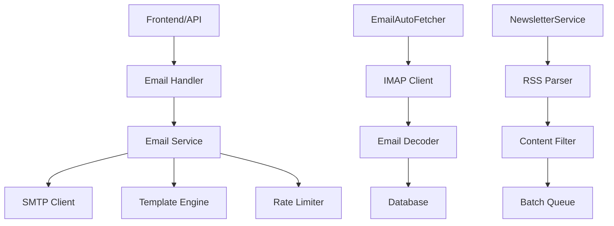

# 📧 Email System - Complete Technical Guide

> **Version:** 1.0
> **Status:** Production Ready
> **Last Updated:** 2025-11-06
> **Backend:** DKL Email Service V1.48.0+

Complete technische documentatie van het email systeem voor het verzenden en ontvangen van emails in de DKL Email Service.

---

## 📋 Inhoudsopgave

1. [Executive Summary](#executive-summary)
2. [System Architecture](#system-architecture)
3. [Email Types & Templates](#email-types--templates)
4. [SMTP Configuration](#smtp-configuration)
5. [IMAP Configuration & Inbox Management](#imap-configuration--inbox-management)
6. [Email Batching & Queue](#email-batching--queue)
7. [Rate Limiting](#rate-limiting)
8. [API Endpoints](#api-endpoints)
9. [Inbox Management API](#inbox-management-api)
10. [Models & Data Structures](#models--data-structures)
11. [Email Processing](#email-processing)
12. [Frontend Integration](#frontend-integration)
13. [Testing](#testing)
14. [Troubleshooting](#troubleshooting)
15. [Migration History](#migration-history)
16. [Related Documentation](#related-documentation)

---

## 🎯 Executive Summary

Het DKL Email Service implementeert een enterprise-grade email systeem met:

### Kernfunctionaliteit
- ✅ **Multi-SMTP Support** - Separate SMTP configs voor verschillende domeinen
- ✅ **Template-Based Emails** - HTML templates met dynamic content injection
- ✅ **Email Batching** - Efficiënt bulk verzending met queue management
- ✅ **Rate Limiting** - Per-type en per-IP limiting
- ✅ **Dual Inbox Management** - info@ en inschrijving@ met volledige API
- ✅ **Email Fetching** - Automatisch ophalen van inkomende emails (elke 5 min)
- ✅ **Advanced Decoding** - MIME, charset, encoding support met bluemonday sanitization
- ✅ **Newsletter System** - RSS-based automated newsletters
- ✅ **WFC Integration** - Whisky for Charity order emails

### Technische Stack
- **Backend:** Go + Fiber framework
- **Email Library:** Native SMTP met TLS support
- **Templates:** HTML templates met Go template syntax
- **Queue:** In-memory batching met configurable intervals
- **Storage:** PostgreSQL voor verzonden emails en templates
- **Fetching:** IMAP voor inkomende emails

---

## 🏗️ System Architecture

### Component Overview



### Email Flow

1. **Outgoing Email Flow:**
   ```
   API Request → Validation → Template Rendering → Queue/Batch → SMTP Send → Database Log
   ```

2. **Incoming Email Flow:**
   ```
   IMAP Fetch → MIME Decode → Content Extract → Database Store → Processing
   ```

3. **Newsletter Flow:**
   ```
   RSS Feed → Content Parse → Template Render → Batch Queue → SMTP Send
   ```

### Key Design Decisions

- **Multi-SMTP:** Verschillende SMTP configs voor verschillende email types
- **Template-Driven:** Alle emails gebruiken templates voor consistentie
- **Batch Processing:** Efficiënt bulk verzending
- **Rate Limited:** Bescherming tegen abuse
- **Advanced Decoding:** Ondersteuning voor complexe email formats

---

## 📧 Email Types & Templates

### Core Email Types

#### 1. Contact Emails
**Purpose:** Contact formulier communicatie
**Templates:**
- `contact_email.html` - Bevestiging naar indiener
- `contact_admin_email.html` - Notificatie naar admin

**SMTP Config:** Default SMTP
**Handler:** `HandleContactEmail` in `email_handler.go`

#### 2. Aanmelding Emails (Registration)
**Purpose:** Registratie bevestigingen
**Templates:**
- `aanmelding_email.html` - Bevestiging naar deelnemer
- `aanmelding_admin_email.html` - Notificatie naar admin

**SMTP Config:** Registration SMTP (separate from default)
**Handler:** `HandleRegistrationEmail` in `email_handler.go`

#### 3. Newsletter Emails
**Purpose:** Geautomatiseerde nieuwsbrieven
**Templates:**
- `newsletter.html` - Newsletter content

**SMTP Config:** Dedicated newsletter SMTP
**Handler:** Newsletter service (separate component)

#### 4. WFC Order Emails
**Purpose:** Whisky for Charity bestellingen
**Templates:**
- `wfc_order_confirmation.html` - Klant bevestiging
- `wfc_order_admin.html` - Admin notificatie

**SMTP Config:** Dedicated WFC SMTP (SSL enabled)
**Handler:** `HandleWFCOrderEmail` in `wfc_order_handler.go`

### Template Structure

```html
<!-- Base template structure -->
<!DOCTYPE html>
<html lang="nl">
<head>
    <meta charset="UTF-8">
    <meta name="viewport" content="width=device-width, initial-scale=1.0">
    <title>{{.Subject}}</title>
    <style>
        /* Responsive email styles */
        body { font-family: Arial, sans-serif; }
        .container { max-width: 600px; margin: 0 auto; }
        /* ... more styles ... */
    </style>
</head>
<body>
    <div class="container">
        <header>
            
        </header>

        <main>
            {{.Content}} <!-- Dynamic content -->
        </main>

        <footer>
            <p>© {{.Year}} De Koninklijke Loop</p>
        </footer>
    </div>
</body>
</html>
```

### Template Variables

```go
// Common template data
type EmailTemplateData struct {
    Subject     string
    LogoUrl     string
    Year        int
    Content     string
    UnsubscribeUrl string // For newsletters
}

// Contact specific
type ContactEmailData struct {
    EmailTemplateData
    Contact Contact
}

// Aanmelding specific
type AanmeldingEmailData struct {
    EmailTemplateData
    Aanmelding Aanmelding
    Event Event
}

// WFC Order specific
type WFCOrderEmailData struct {
    EmailTemplateData
    Order WFCOrder
    Items []WFCOrderItem
}
```

---

## ⚙️ SMTP Configuration

### Multiple SMTP Configurations

```env
# Default SMTP (Contact, Aanmelding)
SMTP_HOST=smtp.dkl.nl
SMTP_PORT=587
SMTP_USERNAME=user@dkl.nl
SMTP_PASSWORD=password
SMTP_FROM=noreply@dkl.nl

# Registration SMTP (separate from default)
REG_SMTP_HOST=smtp.registration.nl
REG_SMTP_PORT=587
REG_SMTP_USERNAME=registration@dkl.nl
REG_SMTP_PASSWORD=password
REG_SMTP_FROM=inschrijving@dkl.nl

# Newsletter SMTP
NEWSLETTER_SMTP_HOST=smtp.newsletter-provider.com
NEWSLETTER_SMTP_PORT=587
NEWSLETTER_SMTP_USERNAME=newsletter@dkl.nl
NEWSLETTER_SMTP_PASSWORD=password
NEWSLETTER_SMTP_FROM=nieuwsbrief@dkl.nl

# WFC SMTP
WFC_SMTP_HOST=mail.wfc.nl
WFC_SMTP_PORT=465
WFC_SMTP_USERNAME=orders@wfc.nl
WFC_SMTP_PASSWORD=password
WFC_SMTP_FROM=noreply@wfc.nl
WFC_SMTP_SSL=true
```

### SMTP Client Implementation

```go
// RealSMTPClient implementeert de SMTP client interface
type RealSMTPClient struct {
    defaultConf        *SMTPConfig
    regConf            *SMTPConfig
    wfcConf            *SMTPConfig // Nieuwe configuratie voor Whisky for Charity
    dialer             SMTPDialer
    defaultDialer      *gomail.Dialer
    registrationDialer *gomail.Dialer
    wfcDialer          *gomail.Dialer // Nieuwe dialer voor Whisky for Charity
    connMutex          sync.Mutex
}

// SMTPConfig bevat de configuratie voor een SMTP verbinding
type SMTPConfig struct {
    Host     string
    Port     int
    Username string
    Password string
    From     string
    UseSSL   bool // Toegevoegd voor directe SSL verbindingen
}

// Core methods (matches SMTPClient interface)
func (c *RealSMTPClient) Send(msg *EmailMessage) error
func (c *RealSMTPClient) SendRegistration(msg *EmailMessage) error
func (c *RealSMTPClient) SendWFC(msg *EmailMessage) error
func (c *RealSMTPClient) SendWithFrom(from string, msg *EmailMessage) error
func (c *RealSMTPClient) SendEmail(to, subject, body string, fromAddress ...string) error
func (c *RealSMTPClient) SendWFCEmail(to, subject, body string) error
```

---

## 📬 IMAP Configuration & Inbox Management

### Inbox Overview

Het systeem beheert **twee aparte email inboxen** die automatisch worden gemonitord:

#### 1. `info@dekoninklijkeloop.nl`
- **Doel:** Algemene contactformulier emails en vragen
- **Account Type:** `info`
- **IMAP Config:**
  ```env
  INFO_EMAIL=info@dekoninklijkeloop.nl
  INFO_EMAIL_PASSWORD=your_password
  IMAP_HOST=imap.gmail.com
  IMAP_PORT=993
  ```
- **Gebruik:** Ontvangt alle emails van het algemene contactformulier

#### 2. `inschrijving@dekoninklijkeloop.nl`
- **Doel:** Evenement registraties en deelnemer aanmeldingen
- **Account Type:** `inschrijving`
- **IMAP Config:**
  ```env
  INSCHRIJVING_EMAIL=inschrijving@dekoninklijkeloop.nl
  INSCHRIJVING_EMAIL_PASSWORD=your_password
  IMAP_HOST=imap.gmail.com
  IMAP_PORT=993
  ```
- **Gebruik:** Ontvangt alle registratie bevestigings-emails

### Automatic Email Fetching

```go
// Email Auto Fetcher configuratie in main.go
mailFetcherTyped := services.NewMailFetcher(serviceFactory.EmailMetrics)

// Account configuratie
if infoEmail := os.Getenv("INFO_EMAIL"); infoEmail != "" {
    if infoPassword := os.Getenv("INFO_EMAIL_PASSWORD"); infoPassword != "" {
        mailFetcherTyped.AddAccount(infoEmail, infoPassword, "imap.gmail.com", 993, "info")
    }
}

if inschrijvingEmail := os.Getenv("INSCHRIJVING_EMAIL"); inschrijvingEmail != "" {
    if inschrijvingPassword := os.Getenv("INSCHRIJVING_EMAIL_PASSWORD"); inschrijvingPassword != "" {
        mailFetcherTyped.AddAccount(inschrijvingEmail, inschrijvingPassword, "imap.gmail.com", 993, "inschrijving")
    }
}

// Start automatisch ophalen
emailAutoFetcher := services.NewEmailAutoFetcher(mailFetcherTyped, repoFactory.IncomingEmail)
emailAutoFetcher.Start() // Runs every 5 minutes by default
```

### Email Fetch Process

```mermaid
graph TB
    A[Auto Fetcher Timer] -->|Every 5 min| B[Connect IMAP]
    B --> C{Per Account}
    C --> D[info@dkl.nl]
    C --> E[inschrijving@dkl.nl]
    D --> F[Fetch New Emails]
    E --> F
    F --> G[Decode Email]
    G --> H[Sanitize HTML]
    H --> I[Save to DB]
    I --> J[Update LastFetch]
```

### Configuration Options

```env
# Email Fetching Configuration
DISABLE_AUTO_EMAIL_FETCH=false  # Set to true to disable automatic fetching
EMAIL_FETCH_INTERVAL=5m         # Fetch interval (default: 5 minutes)

# IMAP Configuration
IMAP_HOST=imap.gmail.com        # IMAP server hostname
IMAP_PORT=993                   # IMAP port (993 for SSL/TLS)

# Info Account
INFO_EMAIL=info@dekoninklijkeloop.nl
INFO_EMAIL_PASSWORD=your_app_password

# Inschrijving Account
INSCHRIJVING_EMAIL=inschrijving@dekoninklijkeloop.nl
INSCHRIJVING_EMAIL_PASSWORD=your_app_password
```

### Gmail App Password Setup

Voor Gmail accounts moet je **App Passwords** gebruiken:

1. Ga naar [Google Account Security](https://myaccount.google.com/security)
2. Schakel 2-Step Verification in
3. Ga naar "App passwords"
4. Genereer een nieuw app password voor "Mail"
5. Gebruik dit password in de `*_EMAIL_PASSWORD` env vars

### Email Processing Features

#### Advanced Email Decoder

Het systeem gebruikt een geavanceerde decoder voor inkomende emails:

```go
// services/email_decoder.go
type EmailDecoder struct {
    WordDecoder *mime.WordDecoder
}

// Ondersteunde features:
// ✓ MIME multipart parsing
// ✓ RFC 2047 header decoding
// ✓ Charset conversion (Windows-1252, ISO-8859-1 → UTF-8)
// ✓ Transfer encoding (quoted-printable, base64)
// ✓ Inline image embedding (CID → data URI)
// ✓ HTML sanitization (bluemonday)
// ✓ Plain text to HTML conversion
```

#### Email Storage

Alle emails worden opgeslagen in de [`incoming_emails`](models/incoming_email.go) tabel:

```go
type IncomingEmail struct {
    ID          string     // UUID
    MessageID   string     // Email Message-ID header
    From        string     // Decoded sender address
    To          string     // Recipient (info@ of inschrijving@)
    Subject     string     // Decoded subject
    Body        string     // Decoded & sanitized HTML body
    ContentType string     // Original content type
    ReceivedAt  time.Time  // Email receive timestamp
    UID         string     // IMAP UID (unique per account)
    AccountType string     // "info" of "inschrijving"
    IsProcessed bool       // Verwerking status
    ProcessedAt *time.Time // Wanneer verwerkt
}
```

### Manual Email Fetch

Naast automatisch ophalen kun je ook handmatig emails ophalen:

```bash
# Via API endpoint
POST /api/mail/fetch
Authorization: Bearer <jwt_token> or <api_key>

# Response
{
  "message": "15 emails opgehaald, 15 succesvol opgeslagen",
  "fetchTime": "2025-11-07T23:45:00Z"
}
```

---

## 📦 Email Batching & Queue

### Batch Processing Architecture

```go
// EmailBatcher is implemented in services/email_batcher.go
type EmailBatcher struct {
    queue     chan *EmailMessage
    batchSize int
    interval  time.Duration
    smtpClient SMTPClient
    repo       EmailRepository
}

type EmailMessage struct {
    To       string
    Subject  string
    Body     string
    TestMode bool
    Type     string // "contact", "aanmelding", "newsletter"
}

// Core batching methods
func (b *EmailBatcher) Start() error
func (b *EmailBatcher) Stop()
func (b *EmailBatcher) QueueEmail(email *EmailMessage) error
func (b *EmailBatcher) processBatch() error
func (b *EmailBatcher) sendBatch(batch []*EmailMessage) error
```

### Queue Management

```go
// Add email to queue
func (b *EmailBatcher) QueueEmail(email *EmailMessage) {
    select {
    case b.queue <- email:
        // Successfully queued
    default:
        // Queue full - send immediately
        go func() {
            if err := b.smtpClient.SendEmail(email.To, email.Subject, email.Body); err != nil {
                log.Printf("Failed to send immediate email: %v", err)
            }
        }()
    }
}
```

---

## 🛡️ Rate Limiting

### Rate Limit Configuration

```go
// Rate limiter per email type (configured in factory.go)
rateLimiter.AddLimit("contact_email", 100, time.Hour, false)    // Globaal
rateLimiter.AddLimit("contact_email", 5, time.Hour, true)       // Per IP
rateLimiter.AddLimit("aanmelding_email", 200, time.Hour, false) // Globaal
rateLimiter.AddLimit("aanmelding_email", 10, time.Hour, true)   // Per IP
rateLimiter.AddLimit("newsletter_send", 1000, time.Hour, false) // Globaal
rateLimiter.AddLimit("wfc_email", 50, time.Hour, false)         // Globaal
```

### Rate Limiter Implementation

```go
// RateLimiter is implemented in services/rate_limiter.go
type RateLimiter struct {
    redis *redis.Client
}

// Core rate limiting methods (matches RateLimiterInterface)
func (r *RateLimiter) AllowEmail(emailType string, ipAddress string) bool
func (r *RateLimiter) CheckLimit(key string, limit int, window time.Duration) (bool, error)
func (r *RateLimiter) AddLimit(emailType string, limit int, window time.Duration, perIP bool)
func (r *RateLimiter) GetLimits() map[string]RateLimit
func (r *RateLimiter) GetCurrentValues() map[string]int
```

---

## 🔌 API Endpoints

### Email Sending Endpoints

#### `POST /api/contact-email`
- **Purpose:** Verstuur contact formulier email
- **Auth:** None (public)
- **Rate Limit:** 100/hour global, 5/hour per IP
- **Body:**
```json
{
  "naam": "string",
  "email": "string",
  "bericht": "string",
  "privacyAkkoord": true
}
```
- **Response:** Success confirmation

#### `POST /api/register`
- **Purpose:** Verstuur aanmelding formulier email (V28 refactor)
- **Auth:** None (public)
- **Rate Limit:** 200/hour global, 10/hour per IP
- **Body:**
```json
{
  "naam": "string",
  "email": "string",
  "telefoon": "string",
  "rol": "string",
  "afstand": "string",
  "ondersteuning": "string",
  "bijzonderheden": "string",
  "terms": true
}
```

#### `POST /api/wfc/order-email`
- **Purpose:** Verstuur WFC order bevestiging
- **Auth:** API Key required
- **Rate Limit:** 50/hour
- **Body:**
```json
{
  "customer_name": "string",
  "customer_email": "string",
  "total_amount": 150.00,
  "items": [
    {
      "name": "Whisky 1",
      "quantity": 2,
      "price": 75.00
    }
  ]
}
```

### Email Management Endpoints

#### `GET /api/mail`
- **Purpose:** Lijst van inkomende emails
- **Auth:** JWT required
- **Permissions:** `email:read`
- **Query Params:** `limit`, `offset`, `status`

#### `POST /api/admin/mail/reprocess`
- **Purpose:** Herprocess alle emails in database
- **Auth:** JWT required
- **Permissions:** `admin_email:send`

---

## 📥 Inbox Management API

### Overview

De Inbox Management API biedt volledige toegang tot de twee email inboxen (`info@` en `inschrijving@`). Alle endpoints vereisen authenticatie via JWT token of API key.

### Authentication

Alle inbox endpoints gebruiken een dual authentication strategie:

```javascript
// Option 1: JWT Token (voor ingelogde gebruikers)
Authorization: Bearer <jwt_token>

// Option 2: API Key (voor externe systemen)
Authorization: Bearer <ADMIN_API_KEY>
```

Gebruikers moeten de `admin:access` permissie hebben.

### Endpoints

#### `GET /api/mail`
Haal een gepagineerde lijst van alle emails op (beide inboxen).

**Authentication:** JWT Token of API Key
**Permissions:** `admin:access`
**Query Parameters:**
- `limit` (optional): Aantal resultaten (1-100, default: 10)
- `offset` (optional): Offset voor paginatie (default: 0)

**Response:**
```json
{
  "emails": [
    {
      "id": "550e8400-e29b-41d4-a716-446655440000",
      "message_id": "<abc123@mail.gmail.com>",
      "sender": "jan@example.com",
      "to": "info@dekoninklijkeloop.nl",
      "subject": "Vraag over het evenement",
      "html": "<p>Gedecodeerde en gesanitized HTML content...</p>",
      "content_type": "text/html; charset=UTF-8",
      "received_at": "2025-11-07T14:30:00Z",
      "uid": "12345",
      "account_type": "info",
      "read": false,
      "processed_at": null,
      "created_at": "2025-11-07T14:30:05Z",
      "updated_at": "2025-11-07T14:30:05Z"
    }
  ],
  "totalCount": 150
}
```

**Example:**
```bash
curl -X GET "https://api.dekoninklijkeloop.nl/api/mail?limit=20&offset=0" \
  -H "Authorization: Bearer <your_token>"
```

---

#### `GET /api/mail/:id`
Haal details van een specifieke email op.

**Authentication:** JWT Token of API Key
**Permissions:** `admin:access`
**Path Parameters:**
- `id`: Email ID (UUID)

**Response:**
```json
{
  "id": "550e8400-e29b-41d4-a716-446655440000",
  "message_id": "<abc123@mail.gmail.com>",
  "sender": "jan@example.com",
  "to": "info@dekoninklijkeloop.nl",
  "subject": "Vraag over het evenement",
  "html": "<div><p>Volledige email content hier...</p></div>",
  "content_type": "text/html; charset=UTF-8",
  "received_at": "2025-11-07T14:30:00Z",
  "uid": "12345",
  "account_type": "info",
  "read": false,
  "processed_at": null,
  "created_at": "2025-11-07T14:30:05Z",
  "updated_at": "2025-11-07T14:30:05Z"
}
```

**Example:**
```bash
curl -X GET "https://api.dekoninklijkeloop.nl/api/mail/550e8400-e29b-41d4-a716-446655440000" \
  -H "Authorization: Bearer <your_token>"
```

---

#### `GET /api/mail/account/:type`
Haal emails op van een specifiek account type (info of inschrijving).

**Authentication:** JWT Token of API Key
**Permissions:** `admin:access`
**Path Parameters:**
- `type`: Account type (`info` of `inschrijving`)

**Query Parameters:**
- `limit` (optional): Aantal resultaten (1-100, default: 10)
- `offset` (optional): Offset voor paginatie (default: 0)

**Response:**
```json
{
  "emails": [
    {
      "id": "...",
      "account_type": "info",
      ...
    }
  ],
  "totalCount": 75
}
```

**Examples:**
```bash
# Alle info@ emails
curl -X GET "https://api.dekoninklijkeloop.nl/api/mail/account/info" \
  -H "Authorization: Bearer <your_token>"

# Alle inschrijving@ emails
curl -X GET "https://api.dekoninklijkeloop.nl/api/mail/account/inschrijving?limit=50" \
  -H "Authorization: Bearer <your_token>"
```

---

#### `GET /api/mail/unprocessed`
Haal alle onverwerkte (ongelezen) emails op.

**Authentication:** JWT Token of API Key
**Permissions:** `admin:access`

**Response:**
```json
[
  {
    "id": "...",
    "read": false,
    "processed_at": null,
    ...
  }
]
```

**Example:**
```bash
curl -X GET "https://api.dekoninklijkeloop.nl/api/mail/unprocessed" \
  -H "Authorization: Bearer <your_token>"
```

---

#### `PUT /api/mail/:id/processed`
Markeer een email als verwerkt (gelezen).

**Authentication:** JWT Token of API Key
**Permissions:** `admin:access`
**Path Parameters:**
- `id`: Email ID (UUID)

**Response:**
```json
{
  "message": "Email 550e8400-e29b-41d4-a716-446655440000 gemarkeerd als verwerkt"
}
```

**Example:**
```bash
curl -X PUT "https://api.dekoninklijkeloop.nl/api/mail/550e8400-e29b-41d4-a716-446655440000/processed" \
  -H "Authorization: Bearer <your_token>"
```

---

#### `DELETE /api/mail/:id`
Verwijder een email permanent uit de database.

**Authentication:** JWT Token of API Key
**Permissions:** `admin:access`
**Path Parameters:**
- `id`: Email ID (UUID)

**Response:**
```json
{
  "success": true,
  "message": "Email succesvol verwijderd"
}
```

**Example:**
```bash
curl -X DELETE "https://api.dekoninklijkeloop.nl/api/mail/550e8400-e29b-41d4-a716-446655440000" \
  -H "Authorization: Bearer <your_token>"
```

---

#### `POST /api/mail/fetch`
Haal handmatig nieuwe emails op van de mailserver.

**Authentication:** JWT Token of API Key
**Permissions:** `admin:access`

Dit triggert een handmatige fetch van beide inboxen en slaat nieuwe emails op.

**Response:**
```json
{
  "message": "15 emails opgehaald, 15 succesvol opgeslagen",
  "fetchTime": "2025-11-07T23:45:00Z"
}
```

**Example:**
```bash
curl -X POST "https://api.dekoninklijkeloop.nl/api/mail/fetch" \
  -H "Authorization: Bearer <your_token>"
```

---

#### `POST /api/admin/mail/reprocess`
Herverwerk alle emails in de database met verbeterde decoding.

**Authentication:** JWT Token
**Permissions:** `admin_email:send`

Dit is nuttig na email decoder updates om oude emails opnieuw te verwerken.

**Response:**
```json
{
  "success": true,
  "message": "Email reprocessing voltooid",
  "processed": 142,
  "failed": 3
}
```

**Example:**
```bash
curl -X POST "https://api.dekoninklijkeloop.nl/api/admin/mail/reprocess" \
  -H "Authorization: Bearer <your_token>"
```

---

### Implementation Details

#### Handler Implementation

De inbox management wordt afgehandeld door de [`MailHandler`](handlers/mail_handler.go):

```go
type MailHandler struct {
    mailFetcher       *services.MailFetcher
    incomingEmailRepo repository.IncomingEmailRepository
    authService       services.AuthService
    permissionService services.PermissionService
}

// Registreer routes met authentication middleware
func (h *MailHandler) RegisterRoutes(app *fiber.App) {
    mailGroup := app.Group("/api/mail")
    
    // Custom auth middleware (JWT of API key)
    mailGroup.Use(func(c *fiber.Ctx) error {
        // Check API key or JWT token
        // Verify admin:access permission
    })
    
    mailGroup.Get("/", h.ListEmails)
    mailGroup.Get("/:id", h.GetEmail)
    mailGroup.Put("/:id/processed", h.MarkAsProcessed)
    mailGroup.Delete("/:id", h.DeleteEmail)
    mailGroup.Post("/fetch", h.FetchEmails)
    mailGroup.Get("/unprocessed", h.ListUnprocessedEmails)
    mailGroup.Get("/account/:type", h.ListEmailsByAccountType)
}
```

#### Response Mapping

Emails worden gemapped naar een [`MailResponse`](handlers/mail_handler.go:18) DTO:

```go
type MailResponse struct {
    ID          string     `json:"id"`
    MessageID   string     `json:"message_id"`
    From        string     `json:"sender"`
    To          string     `json:"to"`
    Subject     string     `json:"subject"`
    HTML        string     `json:"html"`          // Body → HTML mapping
    ContentType string     `json:"content_type"`
    ReceivedAt  time.Time  `json:"received_at"`
    UID         string     `json:"uid"`
    AccountType string     `json:"account_type"`
    IsProcessed bool       `json:"read"`
    ProcessedAt *time.Time `json:"processed_at"`
    CreatedAt   time.Time  `json:"created_at"`
    UpdatedAt   time.Time  `json:"updated_at"`
}
```

**⚠️ Important:** Het `Body` veld in het model wordt gemapped naar `HTML` in de response voor frontend compatibility.

---

## 📊 Models & Data Structures

### Core Email Models

#### `VerzondEmail` - Email tracking
```go
type VerzondEmail struct {
    ID          string    `json:"id" gorm:"primaryKey;type:uuid;default:gen_random_uuid()"`
    Ontvanger   string    `json:"ontvanger" gorm:"not null;index"`
    Onderwerp   string    `json:"onderwerp" gorm:"not null"`
    Inhoud      string    `json:"inhoud" gorm:"type:text;not null"`
    VerzondOp   time.Time `json:"verzonden_op" gorm:"autoCreateTime;index"`
    Status      string    `json:"status" gorm:"default:'verzonden';index"`
    FoutBericht string    `json:"fout_bericht" gorm:"type:text"`

    // Optionele relaties
    ContactID     *string `json:"contact_id" gorm:"index"`
    ParticipantID *string `json:"participant_id" gorm:"index"`
    TemplateID    *string `json:"template_id"`

    // Relations
    Contact     *ContactFormulier `json:"-" gorm:"foreignKey:ContactID"`
    Participant *Participant      `json:"-" gorm:"foreignKey:ParticipantID"`
    Template    *EmailTemplate    `json:"-" gorm:"foreignKey:TemplateID"`
}
```

#### `IncomingEmail` - Received emails
```go
type IncomingEmail struct {
    ID          string     `json:"id" gorm:"primaryKey"`
    MessageID   string     `json:"message_id" gorm:"index"`
    From        string     `json:"sender"`
    To          string     `json:"to"`
    Subject     string     `json:"subject"`
    Body        string     `json:"body" gorm:"type:text"`
    ContentType string     `json:"content_type"`
    ReceivedAt  time.Time  `json:"received_at"`
    UID         string     `json:"uid" gorm:"uniqueIndex"`
    AccountType string     `json:"account_type" gorm:"index"` // "info" of "inschrijving"
    IsProcessed bool       `json:"read" gorm:"index"`
    ProcessedAt *time.Time `json:"processed_at"`
    CreatedAt   time.Time  `json:"created_at" gorm:"autoCreateTime"`
    UpdatedAt   time.Time  `json:"updated_at" gorm:"autoUpdateTime"`
}
```

#### `EmailTemplate` - Template storage
```go
type EmailTemplate struct {
    ID           string    `json:"id" gorm:"primaryKey;type:uuid;default:gen_random_uuid()"`
    Naam         string    `json:"naam" gorm:"not null;uniqueIndex"`
    Onderwerp    string    `json:"onderwerp" gorm:"not null"`
    Inhoud       string    `json:"inhoud" gorm:"type:text;not null"`
    Beschrijving string    `json:"beschrijving" gorm:"type:text"`
    IsActief     bool      `json:"is_actief" gorm:"default:true"`
    CreatedAt    time.Time `json:"created_at" gorm:"autoCreateTime"`
    UpdatedAt    time.Time `json:"updated_at" gorm:"autoUpdateTime"`
    CreatedBy    string    `json:"created_by"`
    UpdatedBy    string    `json:"updated_by"`
}
```

---

## 🔄 Email Processing

### Advanced Email Decoder

```go
// EmailDecoder is implemented in services/email_decoder.go
type EmailDecoder struct {
    WordDecoder *mime.WordDecoder
}

// Core decoding methods
func (d *EmailDecoder) DecodeEmail(m *mail.Message) (*DecodedEmail, error)
func (d *EmailDecoder) DecodeEmailBody(m *mail.Message) (string, error)
func (d *EmailDecoder) DecodeSubject(subject string) string
func (d *EmailDecoder) DecodeFrom(from string) string
func (d *EmailDecoder) decodeHeader(s string) string
func (d *EmailDecoder) parsePart(body io.Reader, header mail.Header, result *DecodedEmail) error
func (d *EmailDecoder) processNonMultipart(body io.Reader, header mail.Header, result *DecodedEmail) error
func (d *EmailDecoder) decodePartBody(reader io.Reader, header mail.Header) ([]byte, error)
func (d *EmailDecoder) decodeTransferEncoding(reader io.Reader, encoding string) (io.Reader, error)
func (d *EmailDecoder) convertCharset(reader io.Reader, charsetName string) (io.Reader, error)
func (d *EmailDecoder) embedInlineImages(email *DecodedEmail)
func (d *EmailDecoder) textToHTML(text string) string
```

**Key Features:**
- ✅ **MIME Multipart Support** - Handles complex multipart email structures
- ✅ **RFC 2047 Header Decoding** - Properly decodes encoded subject and address headers
- ✅ **Charset Conversion** - Converts Windows-1252, ISO-8859-1 to UTF-8
- ✅ **Transfer Encoding** - Supports quoted-printable and base64 decoding
- ✅ **Inline Images** - Embeds CID images as data URIs in HTML
- ✅ **HTML Sanitization** - Integrates with bluemonday for security
- ✅ **Fallback Handling** - Graceful degradation on decoding failures

### Email Auto Fetcher

```go
// EmailAutoFetcher is implemented in services/email_auto_fetcher.go
type EmailAutoFetcher struct {
    imapClient *imap.Client
    decoder    *EmailDecoder
    interval   time.Duration
    repo       EmailRepository
}

// Core fetching methods (matches EmailAutoFetcherInterface)
func (f *EmailAutoFetcher) Start() error
func (f *EmailAutoFetcher) Stop()
func (f *EmailAutoFetcher) IsRunning() bool
func (f *EmailAutoFetcher) GetLastRunTime() time.Time
func (f *EmailAutoFetcher) fetchEmails() error
func (f *EmailAutoFetcher) connectIMAP() (*imap.Client, error)
func (f *EmailAutoFetcher) processEmail(client *imap.Client, uid uint32) error
```

---

## 💻 Frontend Integration

### React Example - Email Inbox Viewer

```typescript
// EmailInbox.tsx
import React, { useState, useEffect } from 'react';
import axios from 'axios';

interface Email {
  id: string;
  sender: string;
  to: string;
  subject: string;
  html: string;
  received_at: string;
  account_type: 'info' | 'inschrijving';
  read: boolean;
}

const EmailInbox: React.FC = () => {
  const [emails, setEmails] = useState<Email[]>([]);
  const [selectedEmail, setSelectedEmail] = useState<Email | null>(null);
  const [accountType, setAccountType] = useState<'info' | 'inschrijving' | 'all'>('all');
  const [loading, setLoading] = useState(false);

  useEffect(() => {
    fetchEmails();
  }, [accountType]);

  const fetchEmails = async () => {
    setLoading(true);
    try {
      const endpoint = accountType === 'all' 
        ? '/api/mail?limit=50'
        : `/api/mail/account/${accountType}?limit=50`;
      
      const response = await axios.get(endpoint, {
        headers: {
          Authorization: `Bearer ${localStorage.getItem('token')}`
        }
      });
      
      setEmails(response.data.emails || response.data);
    } catch (error) {
      console.error('Failed to fetch emails:', error);
    } finally {
      setLoading(false);
    }
  };

  const markAsRead = async (emailId: string) => {
    try {
      await axios.put(`/api/mail/${emailId}/processed`, {}, {
        headers: {
          Authorization: `Bearer ${localStorage.getItem('token')}`
        }
      });
      
      setEmails(emails.map(e => 
        e.id === emailId ? { ...e, read: true } : e
      ));
    } catch (error) {
      console.error('Failed to mark email as read:', error);
    }
  };

  const deleteEmail = async (emailId: string) => {
    if (!confirm('Weet je zeker dat je deze email wilt verwijderen?')) return;
    
    try {
      await axios.delete(`/api/mail/${emailId}`, {
        headers: {
          Authorization: `Bearer ${localStorage.getItem('token')}`
        }
      });
      
      setEmails(emails.filter(e => e.id !== emailId));
      if (selectedEmail?.id === emailId) {
        setSelectedEmail(null);
      }
    } catch (error) {
      console.error('Failed to delete email:', error);
    }
  };

  return (
    <div className="email-inbox">
      <div className="inbox-header">
        <h1>Email Inbox</h1>
        <div className="account-filter">
          <button onClick={() => setAccountType('all')}>Alle</button>
          <button onClick={() => setAccountType('info')}>Info</button>
          <button onClick={() => setAccountType('inschrijving')}>Inschrijving</button>
        </div>
      </div>

      <div className="inbox-content">
        <div className="email-list">
          {loading ? (
            <p>Laden...</p>
          ) : (
            emails.map(email => (
              <div 
                key={email.id}
                className={`email-item ${!email.read ? 'unread' : ''}`}
                onClick={() => setSelectedEmail(email)}
              >
                <div className="email-sender">{email.sender}</div>
                <div className="email-subject">{email.subject}</div>
                <div className="email-date">
                  {new Date(email.received_at).toLocaleString('nl-NL')}
                </div>
                <span className={`account-badge ${email.account_type}`}>
                  {email.account_type}
                </span>
              </div>
            ))
          )}
        </div>

        <div className="email-viewer">
          {selectedEmail ? (
            <>
              <div className="email-header">
                <h2>{selectedEmail.subject}</h2>
                <div className="email-meta">
                  <p><strong>Van:</strong> {selectedEmail.sender}</p>
                  <p><strong>Aan:</strong> {selectedEmail.to}</p>
                  <p><strong>Datum:</strong> {new Date(selectedEmail.received_at).toLocaleString('nl-NL')}</p>
                </div>
                <div className="email-actions">
                  {!selectedEmail.read && (
                    <button onClick={() => markAsRead(selectedEmail.id)}>
                      Markeer als gelezen
                    </button>
                  )}
                  <button onClick={() => deleteEmail(selectedEmail.id)}>
                    Verwijder
                  </button>
                </div>
              </div>
              <div 
                className="email-body"
                dangerouslySetInnerHTML={{ __html: selectedEmail.html }}
              />
            </>
          ) : (
            <p>Selecteer een email om te bekijken</p>
          )}
        </div>
      </div>
    </div>
  );
};

export default EmailInbox;
```

### JavaScript Fetch Example

```javascript
// emailService.js
class EmailService {
  constructor(baseURL, token) {
    this.baseURL = baseURL;
    this.token = token;
  }

  async getAllEmails(limit = 50, offset = 0) {
    const response = await fetch(
      `${this.baseURL}/api/mail?limit=${limit}&offset=${offset}`,
      {
        headers: {
          'Authorization': `Bearer ${this.token}`
        }
      }
    );
    
    if (!response.ok) {
      throw new Error('Failed to fetch emails');
    }
    
    return response.json();
  }

  async getEmailsByAccount(accountType, limit = 50) {
    const response = await fetch(
      `${this.baseURL}/api/mail/account/${accountType}?limit=${limit}`,
      {
        headers: {
          'Authorization': `Bearer ${this.token}`
        }
      }
    );
    
    return response.json();
  }

  async getUnreadEmails() {
    const response = await fetch(
      `${this.baseURL}/api/mail/unprocessed`,
      {
        headers: {
          'Authorization': `Bearer ${this.token}`
        }
      }
    );
    
    return response.json();
  }

  async markAsRead(emailId) {
    const response = await fetch(
      `${this.baseURL}/api/mail/${emailId}/processed`,
      {
        method: 'PUT',
        headers: {
          'Authorization': `Bearer ${this.token}`
        }
      }
    );
    
    return response.json();
  }

  async deleteEmail(emailId) {
    const response = await fetch(
      `${this.baseURL}/api/mail/${emailId}`,
      {
        method: 'DELETE',
        headers: {
          'Authorization': `Bearer ${this.token}`
        }
      }
    );
    
    return response.json();
  }

  async fetchNewEmails() {
    const response = await fetch(
      `${this.baseURL}/api/mail/fetch`,
      {
        method: 'POST',
        headers: {
          'Authorization': `Bearer ${this.token}`
        }
      }
    );
    
    return response.json();
  }
}

// Gebruik:
const emailService = new EmailService('https://api.dekoninklijkeloop.nl', 'your_token');

// Haal alle emails op
const { emails, totalCount } = await emailService.getAllEmails(20, 0);

// Haal info@ emails op
const infoEmails = await emailService.getEmailsByAccount('info');

// Markeer als gelezen
await emailService.markAsRead(emailId);
```

### Security Considerations

#### XSS Protection

Emails kunnen potentieel malicious HTML bevatten. Het systeem gebruikt [`bluemonday`](https://github.com/microcosm-cc/bluemonday) voor HTML sanitization:

```go
// services/mail_fetcher.go
if strings.Contains(strings.ToLower(contentType), "text/html") {
    p := bluemonday.UGCPolicy()
    finalBody = p.Sanitize(decodedBody)
}
```

**Frontend Best Practices:**
```typescript
// ✅ GOED: Gebruik dangerouslySetInnerHTML met gesanitized HTML
<div dangerouslySetInnerHTML={{ __html: email.html }} />

// ❌ FOUT: Directe text rendering van HTML
<div>{email.html}</div>

// ✅ EXTRA BEVEILIGING: Content Security Policy
<meta http-equiv="Content-Security-Policy" 
      content="default-src 'self'; img-src 'self' data: https:; style-src 'self' 'unsafe-inline';">
```

---

## 🔧 Troubleshooting

### Common Issues

#### 1. Emails worden niet automatisch opgehaald

**Symptomen:**
- Automatische email fetch werkt niet
- Inbox blijft leeg ondanks nieuwe emails

**Diagnose:**
```bash
# Check of auto fetch is uitgeschakeld
echo $DISABLE_AUTO_EMAIL_FETCH

# Check email fetcher logs
grep "Email auto fetcher" /var/log/app.log

# Handmatig email fetch triggeren
curl -X POST https://api.domain.nl/api/mail/fetch \
  -H "Authorization: Bearer $TOKEN"
```

**Oplossingen:**
1. Verwijder of zet `DISABLE_AUTO_EMAIL_FETCH=false`
2. Controleer email credentials:
   ```env
   INFO_EMAIL=info@dekoninklijkeloop.nl
   INFO_EMAIL_PASSWORD=correct_app_password
   INSCHRIJVING_EMAIL=inschrijving@dekoninklijkeloop.nl
   INSCHRIJVING_EMAIL_PASSWORD=correct_app_password
   ```
3. Restart de service

---

#### 2. Gmail IMAP Authentication Failed

**Error:** `LOGIN mislukt: Invalid credentials`

**Oorzaken:**
- Verkeerde password gebruikt (normaal password i.p.v. app password)
- 2-Step Verification niet ingeschakeld
- App password niet gegenereerd

**Oplossing:**
1. Ga naar [Google Account Security](https://myaccount.google.com/security)
2. Schakel **2-Step Verification** in
3. Ga naar **App passwords**
4. Genereer nieuwe app password voor "Mail"
5. Update `.env`:
   ```env
   INFO_EMAIL_PASSWORD=<16-char-app-password>
   ```
6. Restart service

---

#### 3. Email Body is leeg of corrupt

**Symptomen:**
- Email subject en sender zijn zichtbaar
- Body veld is leeg of bevat onleesbare tekst

**Diagnose:**
```bash
# Check email in database
psql -c "SELECT id, subject, substring(body, 1, 100) FROM incoming_emails WHERE id='<email_id>';"
```

**Oplossingen:**

**Optie 1: Reprocess Emails**
```bash
curl -X POST https://api.domain.nl/api/admin/mail/reprocess \
  -H "Authorization: Bearer $TOKEN"
```

**Optie 2: Check Email Decoder Logs**
```bash
grep "Fout bij decoderen email" /var/log/app.log
```

---

#### 4. Frontend kan emails niet laden

**Error:** `401 Unauthorized` of `403 Forbidden`

**Checklist:**
1. **Token Valid?**
   ```javascript
   const token = localStorage.getItem('token');
   console.log('Token:', token ? 'Present' : 'Missing');
   ```

2. **Permissions Correct?**
   ```bash
   # Check user permissions
   curl https://api.domain.nl/api/auth/profile \
     -H "Authorization: Bearer $TOKEN"
   ```

3. **CORS Configured?**
   ```go
   // In main.go
   allowedOrigins := []string{
       "https://admin.dekoninklijkeloop.nl",
       "http://localhost:3000",
   }
   ```

---

### Debug Tools

#### Enable Debug Logging

```env
LOG_LEVEL=DEBUG
```

Restart service om debug logs te activeren voor:
- Email fetching
- Email decoding
- IMAP operations
- Rate limiting

#### Database Queries

```sql
-- Count emails per account
SELECT account_type, COUNT(*) as count
FROM incoming_emails
GROUP BY account_type;

-- Recent unprocessed emails
SELECT id, sender, subject, received_at, account_type
FROM incoming_emails
WHERE is_processed = false
ORDER BY received_at DESC
LIMIT 10;

-- Email body preview
SELECT id, subject, substring(body, 1, 200) as preview
FROM incoming_emails
WHERE account_type = 'info'
ORDER BY received_at DESC
LIMIT 5;
```

#### Health Check

```bash
# Check service health including email fetcher
curl https://api.domain.nl/api/health

# Expected response
{
  "status": "healthy",
  "database": "connected",
  "redis": "connected",
  "email_fetcher": "running",
  "last_fetch": "2025-11-07T23:45:00Z"
}
```

---

## 🧪 Testing

### Unit Tests

#### Email Service Tests
```go
// Email service tests are in tests/email_service_test.go
func TestEmailService_SendContactEmail(t *testing.T) {
    // Setup
    mockSMTP := &MockSMTPClient{}
    service := NewEmailService(mockSMTP, nil, nil, nil)

    // Test data
    data := &models.ContactEmailData{
        Contact: &models.ContactFormulier{
            Naam:    "Test User",
            Email:   "test@example.com",
            Bericht: "Test message",
        },
        AdminEmail: "admin@test.com",
        ToAdmin:    false,
    }

    // Execute
    err := service.SendContactEmail(data)

    // Assert
    assert.NoError(t, err)
    // Verify SMTP client was called correctly
}
```

#### Integration Tests
```go
func TestEmailAPI_ContactEmail(t *testing.T) {
    // Setup test app
    app := setupTestApp(t)

    // Test request
    req := httptest.NewRequest("POST", "/api/contact-email", strings.NewReader(`{
        "naam": "Test User",
        "email": "test@example.com",
        "bericht": "Test message"
    }`))
    req.Header.Set("Content-Type", "application/json")

    resp, err := app.Test(req)
    assert.NoError(t, err)
    assert.Equal(t, 200, resp.StatusCode)

    // Verify email was queued/sent
    // Check database for verzonden_email record
}
```

### Load Testing

```bash
# Run email load tests
k6 run ./tests/load/email_load_test.js

# Test configuration
export EMAIL_LOAD_TEST_URL=https://dklemailservice.onrender.com/api/contact-email
export EMAIL_LOAD_VUS=10
export EMAIL_LOAD_DURATION=30s
```

---

## 📋 Migration History

### Email System Evolution

#### V1.0 - Initial Email System
- Basic SMTP configuration
- Contact and aanmelding emails
- Simple template system

#### V1.0.3 - Incoming Email Support
- `incoming_emails` table
- IMAP fetching capability
- Email processing workflow

#### V1.21 - Advanced Features
- Multiple SMTP configurations
- Email batching system
- Rate limiting
- Newsletter system

#### V1.48 - WFC Integration
- Dedicated WFC SMTP
- Order email templates
- API key authentication for WFC

### Key Migration Patterns

#### V27 Status Normalization
- **V27_17**: Create `email_status_types` table
- **V27_19**: Seed status types (verzonden, failed, pending)
- **V27_20**: Add `status_key` column to `verzonden_emails`
- **V27_21**: Migrate existing status data
- **V27_22**: Drop old status column
- **V27_23**: Rename `status_key` to `status`
- **V27_24**: Create index on new status column

#### Database Schema Alignment
```sql
-- Current verzonden_emails schema (V27 final)
CREATE TABLE verzonden_emails (
    id UUID PRIMARY KEY DEFAULT gen_random_uuid(),
    ontvanger TEXT NOT NULL,
    onderwerp TEXT NOT NULL,
    inhoud TEXT NOT NULL,
    verzonden_op TIMESTAMPTZ NOT NULL DEFAULT CURRENT_TIMESTAMP,
    status TEXT DEFAULT 'verzonden' REFERENCES email_status_types(status),
    fout_bericht TEXT,
    contact_id UUID REFERENCES contact_formulieren(id),
    participant_id UUID REFERENCES participants(id),
    template_id UUID REFERENCES email_templates(id)
);

-- Current incoming_emails schema
CREATE TABLE incoming_emails (
    id TEXT PRIMARY KEY,
    message_id TEXT,
    "from" TEXT NOT NULL,
    "to" TEXT NOT NULL,
    subject TEXT,
    body TEXT,
    content_type TEXT,
    received_at TIMESTAMPTZ NOT NULL,
    uid TEXT UNIQUE,
    account_type TEXT,
    is_processed BOOLEAN NOT NULL DEFAULT FALSE,
    processed_at TIMESTAMPTZ,
    created_at TIMESTAMPTZ NOT NULL DEFAULT CURRENT_TIMESTAMP,
    updated_at TIMESTAMPTZ NOT NULL DEFAULT CURRENT_TIMESTAMP
);
```

---

## 📚 Related Documentation

- [`01DATABASE_DOC.md`](01DATABASE_DOC.md) - Database architecture overview
- [`02AUTHENTICATION_DOC.md`](02AUTHENTICATION_DOC.md) - Authentication & authorization system
- [`03PARTICIPANT_DOC.md`](03PARTICIPANT_DOC.md) - Participant management system
- [`docs/FRONTEND_EMAIL_API.md`](docs/FRONTEND_EMAIL_API.md) - Frontend email API integration
- [`docs/EMAIL_DECODER_IMPROVEMENTS.md`](docs/EMAIL_DECODER_IMPROVEMENTS.md) - Advanced email decoding
- [`docs/WEBSITE_AUTHENTICATION_ARCHITECTURE.md`](docs/WEBSITE_AUTHENTICATION_ARCHITECTURE.md) - Website integration
- [`README.md`](README.md) - Complete service overview

---

## ⚠️ Critical Implementation Notes

### Email Security
- **SMTP TLS:** Always use TLS encryption
- **Input Sanitization:** Sanitize all email content
- **Rate Limiting:** Prevent email abuse
- **Authentication:** Secure SMTP credentials

### Performance Considerations
- **Batch Processing:** Use batching for bulk emails
- **Connection Pooling:** Reuse SMTP connections
- **Template Caching:** Cache compiled templates
- **Async Processing:** Non-blocking email sending

### Reliability
- **Retry Logic:** Implement exponential backoff
- **Error Handling:** Comprehensive error logging
- **Monitoring:** Track email delivery metrics
- **Fallback:** Graceful degradation on SMTP failure

---

**Version:** 1.0
**Last Updated:** 2025-11-06
**Status:** ✅ Production Ready
**Compatibility:** DKL Email Service V1.48.0+
**Architecture:** Service Layer + Repository Pattern