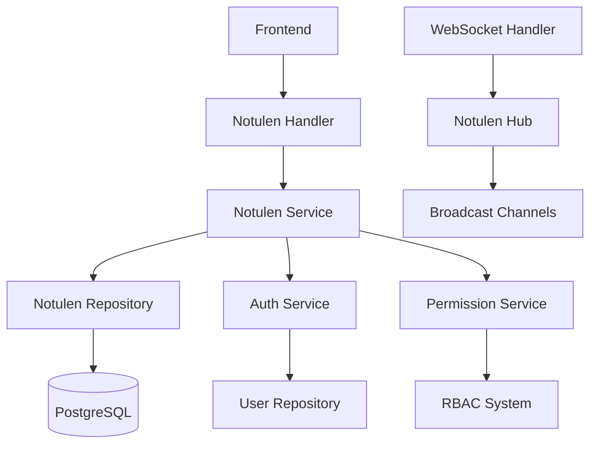

# 📝 Notulen (Meeting Minutes) System - Complete Technical Guide

> **Version:** 1.0
> **Status:** Production Ready
> **Last Updated:** 2025-11-07
> **Backend:** DKL Email Service V1.48.0+

Complete technische documentatie van het notulen systeem voor het beheren van vergadering notulen in de DKL Email Service.

---

## 📋 Inhoudsopgave

1. [Executive Summary](#executive-summary)
2. [System Architecture](#system-architecture)
3. [Database Schema](#database-schema)
4. [API Endpoints](#api-endpoints)
5. [Models & Data Structures](#models--data-structures)
6. [Business Logic](#business-logic)
7. [Version Control](#version-control)
8. [WebSocket Integration](#websocket-integration)
9. [Testing](#testing)
10. [Migration History](#migration-history)
11. [Related Documentation](#related-documentation)

---

## 🎯 Executive Summary

Het DKL Email Service implementeert een enterprise-grade notulen systeem met:

### Kernfunctionaliteit
- ✅ **Meeting Minutes Management** - CRUD operaties voor vergadering notulen
- ✅ **Version Control** - Automatische versie snapshots bij elke wijziging
- ✅ **Participant Tracking** - Geregistreerde gebruikers en gasten
- ✅ **Structured Content** - Agenda items, besluiten en actiepunten
- ✅ **Status Workflow** - Draft → Finalized → Archived lifecycle
- ✅ **Real-time Updates** - WebSocket broadcasting voor live updates
- ✅ **Permission-based Access** - RBAC met granulaire permissies
- ✅ **Search & Filtering** - Full-text search en geavanceerde filters

### Technische Stack
- **Backend:** Go + Fiber framework
- **Database:** PostgreSQL met JSONB voor gestructureerde data
- **Real-time:** WebSocket met custom hub implementatie
- **Versioning:** Trigger-based automatic snapshots
- **Search:** PostgreSQL full-text search (Dutch)
- **Architecture:** Repository pattern + Service layer

---

## 🏗️ System Architecture

### Component Overview



### Data Flow

1. **Creation Process:**
   ```
   CreateRequest → Validation → Participant Resolution → Database Insert → WebSocket Broadcast
   ```

2. **Update Process:**
   ```
   UpdateRequest → Permission Check → Version Snapshot → Database Update → WebSocket Broadcast
   ```

3. **Search Process:**
   ```
   SearchQuery → Full-text Search → Filter Application → Pagination → Response
   ```

### Key Design Decisions

- **JSONB Storage:** Flexible schema voor agenda items, besluiten en actiepunten
- **Dual Participant System:** UUID arrays voor gebruikers + text arrays voor gasten
- **Automatic Versioning:** Trigger-based snapshots bij elke update
- **Real-time Broadcasting:** WebSocket updates voor collaborative editing
- **Permission Integration:** Directe integratie met RBAC systeem

---

## 🗄️ Database Schema

### Core Tables

#### `notulen` - Main meeting minutes table
```sql
CREATE TABLE notulen (
    id UUID PRIMARY KEY DEFAULT gen_random_uuid(),
    titel VARCHAR(255) NOT NULL UNIQUE,
    vergadering_datum DATE NOT NULL,
    locatie VARCHAR(255),
    voorzitter VARCHAR(255),
    notulist VARCHAR(255),

    -- Legacy participant fields (backward compatibility)
    aanwezigen TEXT[],
    afwezigen TEXT[],

    -- New participant fields
    aanwezigen_gebruikers UUID[],  -- Registered users
    afwezigen_gebruikers UUID[],   -- Registered users
    aanwezigen_gasten TEXT[],      -- Guest names
    afwezigen_gasten TEXT[],       -- Guest names

    -- Structured content
    agenda_items JSONB,
    besluiten JSONB,
    actiepunten JSONB,
    notities TEXT,

    -- Workflow
    status VARCHAR(50) DEFAULT 'draft' CHECK (status IN ('draft', 'finalized', 'archived')),
    versie INTEGER DEFAULT 1,

    -- Audit fields
    created_by UUID REFERENCES gebruikers(id),
    created_at TIMESTAMP WITH TIME ZONE DEFAULT CURRENT_TIMESTAMP,
    updated_at TIMESTAMP WITH TIME ZONE DEFAULT CURRENT_TIMESTAMP,
    updated_by UUID REFERENCES gebruikers(id),
    finalized_at TIMESTAMP WITH TIME ZONE,
    finalized_by UUID REFERENCES gebruikers(id)
);
```

#### `notulen_versies` - Version history table
```sql
CREATE TABLE notulen_versies (
    id UUID PRIMARY KEY DEFAULT gen_random_uuid(),
    notulen_id UUID NOT NULL REFERENCES notulen(id) ON DELETE CASCADE,
    versie INTEGER NOT NULL,
    titel VARCHAR(255) NOT NULL,
    vergadering_datum DATE NOT NULL,
    locatie VARCHAR(255),
    voorzitter VARCHAR(255),
    notulist VARCHAR(255),

    -- Participant data (same structure as main table)
    aanwezigen TEXT[],
    afwezigen TEXT[],
    aanwezigen_gebruikers UUID[],
    afwezigen_gebruikers UUID[],
    aanwezigen_gasten TEXT[],
    afwezigen_gasten TEXT[],

    -- Content
    agenda_items JSONB,
    besluiten JSONB,
    actiepunten JSONB,
    notities TEXT,
    status VARCHAR(50),

    -- Version metadata
    gewijzigd_door UUID REFERENCES gebruikers(id),
    gewijzigd_op TIMESTAMP WITH TIME ZONE DEFAULT CURRENT_TIMESTAMP,
    wijziging_reden TEXT
);
```

### Indexes & Performance

```sql
-- Core indexes
CREATE INDEX idx_notulen_datum ON notulen(vergadering_datum);
CREATE INDEX idx_notulen_status ON notulen(status);
CREATE INDEX idx_notulen_created_by ON notulen(created_by);
CREATE INDEX idx_notulen_finalized_by ON notulen(finalized_by);
CREATE INDEX idx_notulen_updated_by ON notulen(updated_by);

-- Full-text search indexes (Dutch language)
CREATE INDEX idx_notulen_titel_gin ON notulen USING gin(to_tsvector('dutch', titel));
CREATE INDEX idx_notulen_notities_gin ON notulen USING gin(to_tsvector('dutch', notities));

-- Participant UUID array indexes (GIN for array operations)
CREATE INDEX idx_notulen_aanwezigen_gebruikers ON notulen USING GIN(aanwezigen_gebruikers);
CREATE INDEX idx_notulen_afwezigen_gebruikers ON notulen USING GIN(afwezigen_gebruikers);

-- Version table indexes
CREATE INDEX idx_notulen_versies_notulen_id ON notulen_versies(notulen_id);
CREATE INDEX idx_notulen_versies_versie ON notulen_versies(notulen_id, versie);
CREATE INDEX idx_notulen_versies_gewijzigd_door ON notulen_versies(gewijzigd_door);
```

### Triggers & Functions

#### Version Control Trigger
```sql
CREATE OR REPLACE FUNCTION create_notulen_version()
RETURNS TRIGGER AS $$
BEGIN
    -- Only create version on updates
    IF TG_OP = 'UPDATE' THEN
        -- Insert current version into history table
        INSERT INTO notulen_versies (
            notulen_id, versie, titel, vergadering_datum, locatie,
            voorzitter, notulist,
            aanwezigen, afwezigen,
            aanwezigen_gebruikers, afwezigen_gebruikers,
            aanwezigen_gasten, afwezigen_gasten,
            agenda_items, besluiten, actiepunten, notities, status,
            gewijzigd_door, wijziging_reden
        ) VALUES (
            OLD.id, OLD.versie, OLD.titel, OLD.vergadering_datum, OLD.locatie,
            OLD.voorzitter, OLD.notulist,
            OLD.aanwezigen, OLD.afwezigen,
            OLD.aanwezigen_gebruikers, OLD.afwezigen_gebruikers,
            OLD.aanwezigen_gasten, OLD.afwezigen_gasten,
            OLD.agenda_items, OLD.besluiten, OLD.actiepunten, OLD.notities, OLD.status,
            COALESCE(NEW.updated_by, NEW.created_by), 'Automatic version snapshot'
        );

        -- Increment version number
        NEW.versie = OLD.versie + 1;
    END IF;

    RETURN NEW;
END;
$$ LANGUAGE plpgsql;

-- Attach trigger
CREATE TRIGGER notulen_version_trigger
BEFORE UPDATE ON notulen
FOR EACH ROW
EXECUTE FUNCTION create_notulen_version();
```

#### Helper Functions

```sql
-- Convert UUID array to user names
CREATE OR REPLACE FUNCTION get_user_names_from_uuids(user_uuids UUID[])
RETURNS TEXT[] AS $$
DECLARE
    user_names TEXT[];
BEGIN
    IF user_uuids IS NULL OR array_length(user_uuids, 1) = 0 THEN
        RETURN ARRAY[]::TEXT[];
    END IF;

    SELECT array_agg(naam ORDER BY naam)
    INTO user_names
    FROM gebruikers
    WHERE id = ANY(user_uuids) AND is_actief = true;

    RETURN COALESCE(user_names, ARRAY[]::TEXT[]);
END;
$$ LANGUAGE plpgsql;

-- Convert user names to UUID array
CREATE OR REPLACE FUNCTION get_user_uuids_from_names(user_names TEXT[])
RETURNS UUID[] AS $$
DECLARE
    user_uuids UUID[];
BEGIN
    IF user_names IS NULL OR array_length(user_names, 1) = 0 THEN
        RETURN ARRAY[]::UUID[];
    END IF;

    SELECT array_agg(id ORDER BY naam)
    INTO user_uuids
    FROM gebruikers
    WHERE naam = ANY(user_names) AND is_actief = true;

    RETURN COALESCE(user_uuids, ARRAY[]::UUID[]);
END;
$$ LANGUAGE plpgsql;
```

### Views for API Compatibility

```sql
-- View combining participants for backward compatibility
CREATE VIEW notulen_with_participants AS
SELECT
    n.*,
    -- Combined aanwezigen (users + guests)
    CASE
        WHEN n.aanwezigen_gebruikers IS NOT NULL AND n.aanwezigen_gasten IS NOT NULL THEN
            get_user_names_from_uuids(n.aanwezigen_gebruikers) || n.aanwezigen_gasten
        WHEN n.aanwezigen_gebruikers IS NOT NULL THEN
            get_user_names_from_uuids(n.aanwezigen_gebruikers)
        WHEN n.aanwezigen_gasten IS NOT NULL THEN
            n.aanwezigen_gasten
        ELSE ARRAY[]::TEXT[]
    END as aanwezigen_combined,

    -- Combined afwezigen (users + guests)
    CASE
        WHEN n.afwezigen_gebruikers IS NOT NULL AND n.afwezigen_gebruikers IS NOT NULL THEN
            get_user_names_from_uuids(n.afwezigen_gebruikers) || n.afwezigen_gasten
        WHEN n.afwezigen_gebruikers IS NOT NULL THEN
            get_user_names_from_uuids(n.afwezigen_gebruikers)
        WHEN n.afwezigen_gasten IS NOT NULL THEN
            n.afwezigen_gasten
        ELSE ARRAY[]::TEXT[]
    END as afwezigen_combined
FROM notulen n;
```

---

## 🔌 API Endpoints

### Notulen CRUD Endpoints (`/api/notulen`)

#### `GET /api/notulen`
- **Purpose:** List all notulen with filtering and pagination
- **Auth:** JWT required
- **Permissions:** `notulen:read`
- **Query Params:**
  - `limit` (int, default: 50, max: 1000)
  - `offset` (int, default: 0)
  - `status` (string: draft, finalized, archived)
  - `created_by` (UUID)
  - `date_from` (YYYY-MM-DD)
  - `date_to` (YYYY-MM-DD)
- **Response:** `NotulenListResponse`

#### `POST /api/notulen`
- **Purpose:** Create new notulen
- **Auth:** JWT required
- **Permissions:** `notulen:write`
- **Body:** `NotulenCreateRequest`
- **Response:** Created `NotulenResponse`

#### `GET /api/notulen/{id}`
- **Purpose:** Get specific notulen with resolved participant names
- **Auth:** JWT required
- **Permissions:** `notulen:read`
- **Response:** `NotulenResponse`

#### `PUT /api/notulen/{id}`
- **Purpose:** Update existing notulen
- **Auth:** JWT required
- **Permissions:** `notulen:write`
- **Body:** `NotulenUpdateRequest`
- **Response:** Updated `NotulenResponse`

#### `DELETE /api/notulen/{id}`
- **Purpose:** Soft delete notulen
- **Auth:** JWT required
- **Permissions:** `notulen:delete`

#### `POST /api/notulen/{id}/finalize`
- **Purpose:** Finalize notulen (prevent further edits)
- **Auth:** JWT required
- **Permissions:** `notulen:finalize`
- **Body:** `NotulenFinalizeRequest`
- **Response:** Success confirmation

#### `POST /api/notulen/{id}/archive`
- **Purpose:** Archive finalized notulen
- **Auth:** JWT required
- **Permissions:** `notulen:archive`

### Search Endpoints

#### `GET /api/notulen/search`
- **Purpose:** Full-text search through notulen
- **Auth:** JWT required
- **Permissions:** `notulen:read`
- **Query Params:**
  - `q` (string) - Search query
  - `limit`, `offset` - Pagination
  - `status`, `created_by`, `date_from`, `date_to` - Filters
- **Response:** `NotulenListResponse`

### Version Control Endpoints

#### `GET /api/notulen/{id}/versions`
- **Purpose:** Get all versions of a notulen
- **Auth:** JWT required
- **Permissions:** `notulen:read`
- **Response:** Array of `NotulenVersie`

#### `GET /api/notulen/{id}/versions/{version}`
- **Purpose:** Get specific version of a notulen
- **Auth:** JWT required
- **Permissions:** `notulen:read`
- **Response:** `NotulenVersie`

### WebSocket Endpoint

#### `GET /api/ws/notulen`
- **Purpose:** Real-time updates via WebSocket
- **Auth:** JWT token in query params
- **Protocol:** JSON messages for subscriptions and broadcasts

---

## 📊 Models & Data Structures

### Core Models

#### `Notulen` - Main entity
```go
type Notulen struct {
    ID                     uuid.UUID    `json:"id" gorm:"type:uuid;primary_key;default:gen_random_uuid()"`
    Titel                  string       `json:"titel" gorm:"type:varchar(255);not null"`
    VergaderingDatum       time.Time    `json:"vergadering_datum" gorm:"type:date;not null"`
    Locatie                string       `json:"locatie,omitempty" gorm:"type:varchar(255)"`
    Voorzitter             string       `json:"voorzitter,omitempty" gorm:"type:varchar(255)"`
    Notulist               string       `json:"notulist,omitempty" gorm:"type:varchar(255)"`

    // Legacy participant fields
    Aanwezigen []string `json:"aanwezigen,omitempty" gorm:"type:jsonb"`
    Afwezigen  []string `json:"afwezigen,omitempty" gorm:"type:jsonb"`

    // New participant fields
    AanwezigenGebruikerIDs UUIDArray `json:"aanwezigen_gebruiker_ids,omitempty" gorm:"type:uuid[]"`
    AfwezigenGebruikerIDs  UUIDArray `json:"afwezigen_gebruiker_ids,omitempty" gorm:"type:uuid[]"`
    AanwezigenGasten       []string  `json:"aanwezigen_gasten,omitempty" gorm:"type:text[]"`
    AfwezigenGasten        []string  `json:"afwezigen_gasten,omitempty" gorm:"type:text[]"`

    // Structured content
    AgendaItems []AgendaItem `json:"agenda_items,omitempty" gorm:"type:jsonb"`
    Besluiten   []Besluit    `json:"besluiten,omitempty" gorm:"type:jsonb"`
    Actiepunten []Actiepunt  `json:"actiepunten,omitempty" gorm:"type:jsonb"`
    Notities    string       `json:"notities,omitempty" gorm:"type:text"`

    // Workflow
    Status     string     `json:"status" gorm:"type:varchar(50);not null;default:'draft'"`
    Versie     int        `json:"versie" gorm:"type:integer;not null;default:1"`

    // Audit
    CreatedBy    uuid.UUID  `json:"created_by" gorm:"type:uuid;not null"`
    CreatedAt    time.Time  `json:"created_at" gorm:"autoCreateTime"`
    UpdatedAt    time.Time  `json:"updated_at" gorm:"autoUpdateTime"`
    UpdatedByID  uuid.UUID  `json:"updated_by_id,omitempty" gorm:"type:uuid"`
    FinalizedAt  *time.Time `json:"finalized_at,omitempty" gorm:"type:timestamp"`
    FinalizedBy  *uuid.UUID `json:"finalized_by,omitempty" gorm:"type:uuid"`
}
```

#### `NotulenVersie` - Version snapshot
```go
type NotulenVersie struct {
    ID                     uuid.UUID    `json:"id" gorm:"type:uuid;primary_key;default:gen_random_uuid()"`
    NotulenID              uuid.UUID    `json:"notulen_id" gorm:"type:uuid;not null"`
    Versie                 int          `json:"versie" gorm:"type:integer;not null"`
    Titel                  string       `json:"titel" gorm:"type:varchar(255);not null"`
    VergaderingDatum       time.Time    `json:"vergadering_datum" gorm:"type:date;not null"`
    Locatie                string       `json:"locatie,omitempty" gorm:"type:varchar(255)"`
    Voorzitter             string       `json:"voorzitter,omitempty" gorm:"type:varchar(255)"`
    Notulist               string       `json:"notulist,omitempty" gorm:"type:varchar(255)"`

    // Participant data (same as main table)
    Aanwezigen             []string     `json:"aanwezigen,omitempty" gorm:"type:jsonb"`
    Afwezigen              []string     `json:"afwezigen,omitempty" gorm:"type:jsonb"`
    AanwezigenGebruikerIDs UUIDArray    `json:"aanwezigen_gebruiker_ids,omitempty" gorm:"type:uuid[]"`
    AfwezigenGebruikerIDs  UUIDArray    `json:"afwezigen_gebruiker_ids,omitempty" gorm:"type:uuid[]"`
    AanwezigenGasten       []string     `json:"aanwezigen_gasten,omitempty" gorm:"type:text[]"`
    AfwezigenGasten        []string     `json:"afwezigen_gasten,omitempty" gorm:"type:text[]"`

    // Content
    AgendaItems []AgendaItem `json:"agenda_items,omitempty" gorm:"type:jsonb"`
    Besluiten   []Besluit    `json:"besluiten,omitempty" gorm:"type:jsonb"`
    Actiepunten []Actiepunt  `json:"actiepunten,omitempty" gorm:"type:jsonb"`
    Notities    string       `json:"notities,omitempty" gorm:"type:text"`
    Status      string       `json:"status" gorm:"type:varchar(50)"`

    // Version metadata
    GewijzigdDoor  uuid.UUID `json:"gewijzigd_door" gorm:"type:uuid;not null"`
    GewijzigdOp    time.Time `json:"gewijzigd_op" gorm:"autoCreateTime"`
    WijzigingReden string    `json:"wijziging_reden,omitempty" gorm:"type:text"`
}
```

### Structured Content Types

#### `AgendaItem` - Meeting agenda items
```go
type AgendaItem struct {
    Titel        string `json:"titel"`
    Beschrijving string `json:"beschrijving,omitempty"`
    Spreker      string `json:"spreker,omitempty"`
    Tijdslot     string `json:"tijdslot,omitempty"`
}
```

#### `Besluit` - Decisions made
```go
type Besluit struct {
    Beschrijving      string     `json:"beschrijving"`
    Verantwoordelijke string     `json:"verantwoordelijke,omitempty"`
    Deadline          *time.Time `json:"deadline,omitempty"`
}
```

#### `Actiepunt` - Action items
```go
type Actiepunt struct {
    Beschrijving      string     `json:"beschrijving"`
    Verantwoordelijke string     `json:"verantwoordelijke"`
    Deadline          *time.Time `json:"deadline,omitempty"`
    Status            string     `json:"status"` // pending, in_progress, completed
}
```

### Request/Response DTOs

#### `NotulenCreateRequest`
```go
type NotulenCreateRequest struct {
    Titel                  string       `json:"titel" validate:"required,min=3,max=255"`
    VergaderingDatum       string       `json:"vergadering_datum" validate:"required"`
    Locatie                string       `json:"locatie,omitempty"`
    Voorzitter             string       `json:"voorzitter,omitempty"`
    Notulist               string       `json:"notulist,omitempty"`

    // Participant fields
    Aanwezigen             []string `json:"aanwezigen,omitempty"`
    Afwezigen              []string `json:"afwezigen,omitempty"`
    AanwezigenGebruikerIDs []string `json:"aanwezigen_gebruiker_ids,omitempty"`
    AfwezigenGebruikerIDs  []string `json:"afwezigen_gebruiker_ids,omitempty"`
    AanwezigenGasten       []string `json:"aanwezigen_gasten,omitempty"`
    AfwezigenGasten        []string `json:"afwezigen_gasten,omitempty"`

    // Content
    AgendaItems []AgendaItem `json:"agenda_items,omitempty"`
    Besluiten   []Besluit    `json:"besluiten,omitempty"`
    Actiepunten []Actiepunt  `json:"actiepunten,omitempty"`
    Notities    string       `json:"notities,omitempty"`
}
```

#### `NotulenResponse` - API response with resolved names
```go
type NotulenResponse struct {
    ID                     uuid.UUID    `json:"id"`
    Titel                  string       `json:"titel"`
    VergaderingDatum       time.Time    `json:"vergadering_datum"`
    Locatie                string       `json:"locatie,omitempty"`
    Voorzitter             string       `json:"voorzitter,omitempty"`
    Notulist               string       `json:"notulist,omitempty"`

    // Resolved participant names
    Aanwezigen []string `json:"aanwezigen"`
    Afwezigen  []string `json:"afwezigen"`

    // Raw participant data
    AanwezigenGebruikerIDs UUIDArray `json:"aanwezigen_gebruiker_ids,omitempty"`
    AfwezigenGebruikerIDs  UUIDArray `json:"afwezigen_gebruiker_ids,omitempty"`
    AanwezigenGasten       []string  `json:"aanwezigen_gasten,omitempty"`
    AfwezigenGasten        []string  `json:"afwezigen_gasten,omitempty"`

    // Content
    AgendaItems []AgendaItem `json:"agenda_items,omitempty"`
    Besluiten   []Besluit    `json:"besluiten,omitempty"`
    Actiepunten []Actiepunt  `json:"actiepunten,omitempty"`
    Notities    string       `json:"notities,omitempty"`

    // Workflow
    Status   string `json:"status"`
    Versie   int    `json:"versie"`

    // Audit with resolved names
    CreatedBy      uuid.UUID  `json:"created_by"`
    CreatedByName  string     `json:"created_by_name,omitempty"`
    CreatedAt      time.Time  `json:"created_at"`
    UpdatedAt      time.Time  `json:"updated_at"`
    UpdatedByID    uuid.UUID  `json:"updated_by_id,omitempty"`
    UpdatedByName  string     `json:"updated_by_name,omitempty"`
    FinalizedAt    *time.Time `json:"finalized_at,omitempty"`
    FinalizedBy    *uuid.UUID `json:"finalized_by,omitempty"`
    FinalizedByName string    `json:"finalized_by_name,omitempty"`
}
```

---

## 🧠 Business Logic

### Creation Process

```go
func (s *NotulenService) CreateNotulen(ctx context.Context, userID uuid.UUID, req *models.NotulenCreateRequest) (*models.Notulen, error) {
    // 1. Parse and validate date
    vergaderingDatum, err := time.Parse("2006-01-02", req.VergaderingDatum)
    if err != nil {
        return nil, fmt.Errorf("ongeldige vergadering datum: %w", err)
    }

    // 2. Convert participant UUID strings to UUID arrays
    var aanwezigenGebruikerIDs models.UUIDArray
    if req.AanwezigenGebruikerIDs != nil {
        uuids := make([]uuid.UUID, 0, len(req.AanwezigenGebruikerIDs))
        for _, userUUIDStr := range req.AanwezigenGebruikerIDs {
            if userUUID, err := uuid.Parse(userUUIDStr); err == nil {
                uuids = append(uuids, userUUID)
            }
        }
        aanwezigenGebruikerIDs = uuids
    }

    // 3. Create notulen entity
    notulen := &models.Notulen{
        ID:                     uuid.New(),
        Titel:                  req.Titel,
        VergaderingDatum:       vergaderingDatum,
        Locatie:                req.Locatie,
        Voorzitter:             req.Voorzitter,
        Notulist:               req.Notulist,
        // ... participant fields ...
        AgendaItems:            req.AgendaItems,
        Besluiten:              req.Besluiten,
        Actiepunten:            req.Actiepunten,
        Notities:               req.Notities,
        Status:                 "draft",
        Versie:                 1,
        CreatedBy:              userID,
        CreatedAt:              time.Now(),
        UpdatedAt:              time.Now(),
    }

    // 4. Save to database (trigger creates version snapshot)
    if err := s.repo.Create(ctx, notulen); err != nil {
        return nil, fmt.Errorf("failed to create notulen: %w", err)
    }

    // 5. Broadcast creation via WebSocket
    if s.hub != nil {
        response := s.ConvertToNotulenResponse(notulen)
        s.hub.BroadcastNotulenCreated(notulen.ID, userID, response)
    }

    return notulen, nil
}
```

### Update Process with Versioning

```go
func (s *NotulenService) UpdateNotulen(ctx context.Context, userID uuid.UUID, id uuid.UUID, req *models.NotulenUpdateRequest) (*models.Notulen, error) {
    // 1. Get existing notulen
    notulen, err := s.repo.GetByID(ctx, id)
    if err != nil || notulen == nil {
        return nil, fmt.Errorf("notulen not found")
    }

    // 2. Check permissions
    if notulen.CreatedBy != userID {
        if !s.permissionService.HasPermission(ctx, userID.String(), "admin", "access") {
            return nil, fmt.Errorf("geen toestemming om notulen te bewerken")
        }
    }

    // 3. Check if finalized
    if notulen.Status == "finalized" {
        return nil, fmt.Errorf("gefinaliseerde notulen kunnen niet worden bewerkt")
    }

    // 4. Apply updates
    if req.Titel != "" {
        notulen.Titel = req.Titel
    }
    // ... apply other field updates ...

    // 5. Handle participant updates
    if req.AanwezigenGebruikerIDs != nil {
        uuids := make([]uuid.UUID, 0, len(req.AanwezigenGebruikerIDs))
        for _, userUUIDStr := range req.AanwezigenGebruikerIDs {
            if userUUID, err := uuid.Parse(userUUIDStr); err == nil {
                uuids = append(uuids, userUUID)
            }
        }
        notulen.AanwezigenGebruikerIDs = uuids
    }

    // 6. Update metadata
    notulen.UpdatedAt = time.Now()
    notulen.UpdatedByID = userID

    // 7. Save (trigger creates version snapshot automatically)
    if err := s.repo.Update(ctx, notulen); err != nil {
        return nil, fmt.Errorf("failed to update notulen: %w", err)
    }

    // 8. Broadcast update
    if s.hub != nil {
        response := s.ConvertToNotulenResponse(notulen)
        s.hub.BroadcastNotulenUpdate(notulen.ID, userID, response)
    }

    return notulen, nil
}
```

### Participant Resolution Logic

```go
func (s *NotulenService) ConvertToNotulenResponse(notulen *models.Notulen) *models.NotulenResponse {
    // 1. Collect all user UUIDs that need name resolution
    userUUIDs := []uuid.UUID{notulen.CreatedBy}
    if notulen.UpdatedByID != uuid.Nil {
        userUUIDs = append(userUUIDs, notulen.UpdatedByID)
    }
    if notulen.FinalizedBy != nil && *notulen.FinalizedBy != uuid.Nil {
        userUUIDs = append(userUUIDs, *notulen.FinalizedBy)
    }

    // Remove duplicates
    uniqueUUIDs := make([]uuid.UUID, 0, len(userUUIDs))
    seen := make(map[uuid.UUID]bool)
    for _, uid := range userUUIDs {
        if !seen[uid] {
            seen[uid] = true
            uniqueUUIDs = append(uniqueUUIDs, uid)
        }
    }

    // 2. Resolve user names
    userNames := s.resolveUserNames(uniqueUUIDs)

    // 3. Create name lookup map
    nameMap := make(map[uuid.UUID]string)
    for i, uid := range uniqueUUIDs {
        if i < len(userNames) {
            nameMap[uid] = userNames[i]
        } else {
            nameMap[uid] = fmt.Sprintf("User-%s", uid.String()[:8])
        }
    }

    // 4. Combine participants (users + guests)
    var aanwezigenCombined []string
    if len(notulen.AanwezigenGebruikerIDs) > 0 {
        resolvedNames := s.resolveUserNames(notulen.AanwezigenGebruikerIDs)
        aanwezigenCombined = append(aanwezigenCombined, resolvedNames...)
    }
    if len(notulen.AanwezigenGasten) > 0 {
        aanwezigenCombined = append(aanwezigenCombined, notulen.AanwezigenGasten...)
    }

    // 5. Create response
    return &models.NotulenResponse{
        ID:                     notulen.ID,
        Titel:                  notulen.Titel,
        // ... other fields ...
        Aanwezigen:             aanwezigenCombined,
        Afwezigen:              afwezigenCombined,
        // ... participant UUIDs and guest arrays ...
        CreatedBy:              notulen.CreatedBy,
        CreatedByName:          nameMap[notulen.CreatedBy],
        UpdatedByID:            notulen.UpdatedByID,
        UpdatedByName:          nameMap[notulen.UpdatedByID],
        FinalizedBy:            notulen.FinalizedBy,
        FinalizedByName:        nameMap[*notulen.FinalizedBy],
    }
}
```

---

## 📋 Version Control

### Automatic Versioning

Het systeem gebruikt PostgreSQL triggers om automatisch versie snapshots te maken bij elke update:

1. **Trigger Activation:** `BEFORE UPDATE` trigger op `notulen` tabel
2. **Snapshot Creation:** Complete kopie van huidige data naar `notulen_versies`
3. **Version Increment:** Versie nummer wordt automatisch verhoogd
4. **Metadata:** Inclusief wijziging reden en gewijzigd_door

### Version Retrieval

```go
func (s *NotulenService) GetNotulenVersions(ctx context.Context, notulenID uuid.UUID) ([]models.NotulenVersie, error) {
    versions, err := s.repo.GetVersions(ctx, notulenID)
    if err != nil {
        return nil, err
    }

    // Resolve user names for each version
    for i := range versions {
        version := &versions[i]

        // Resolve aanwezigen user names
        if len(version.AanwezigenGebruikerIDs) > 0 {
            userNames := s.resolveUserNames(version.AanwezigenGebruikerIDs)
            version.Aanwezigen = append(userNames, version.AanwezigenGasten...)
        }

        // Resolve afwezigen user names
        if len(version.AfwezigenGebruikerIDs) > 0 {
            userNames := s.resolveUserNames(version.AfwezigenGebruikerIDs)
            version.Afwezigen = append(userNames, version.AfwezigenGasten...)
        }
    }

    return versions, nil
}
```

### Version Comparison

Versies kunnen worden vergeleken om wijzigingen te tonen:

```go
func CompareVersions(oldVersion, newVersion *models.NotulenVersie) []string {
    var changes []string

    if oldVersion.Titel != newVersion.Titel {
        changes = append(changes, fmt.Sprintf("Titel gewijzigd: '%s' → '%s'",
            oldVersion.Titel, newVersion.Titel))
    }

    if oldVersion.Locatie != newVersion.Locatie {
        changes = append(changes, fmt.Sprintf("Locatie gewijzigd: '%s' → '%s'",
            oldVersion.Locatie, newVersion.Locatie))
    }

    // Compare participant changes
    oldAanwezigen := append(oldVersion.Aanwezigen, oldVersion.AanwezigenGasten...)
    newAanwezigen := append(newVersion.Aanwezigen, newVersion.AanwezigenGasten...)

    added := difference(newAanwezigen, oldAanwezigen)
    removed := difference(oldAanwezigen, newAanwezigen)

    if len(added) > 0 {
        changes = append(changes, fmt.Sprintf("Toegevoegd aanwezigen: %s", strings.Join(added, ", ")))
    }
    if len(removed) > 0 {
        changes = append(changes, fmt.Sprintf("Verwijderd aanwezigen: %s", strings.Join(removed, ", ")))
    }

    return changes
}
```

---

## 🔌 WebSocket Integration

### NotulenHub Architecture

```go
type NotulenHub struct {
    Clients             map[*NotulenClient]bool
    NotulenUpdate       chan *NotulenUpdateMessage
    NotulenCreated      chan *NotulenCreatedMessage
    NotulenFinalized    chan *NotulenFinalizedMessage
    NotulenArchived     chan *NotulenArchivedMessage
    NotulenDeleted      chan *NotulenDeletedMessage
    Register            chan *NotulenClient
    Unregister          chan *NotulenClient
}
```

### Message Types

#### `NotulenUpdateMessage`
```go
type NotulenUpdateMessage struct {
    Type      string              `json:"type"` // "notulen_update"
    NotulenID string              `json:"notulen_id"`
    UserID    string              `json:"user_id"`
    Username  string              `json:"username"`
    Notulen   *models.NotulenResponse `json:"notulen"`
    Timestamp int64               `json:"timestamp"`
}
```

#### `NotulenCreatedMessage`
```go
type NotulenCreatedMessage struct {
    Type      string              `json:"type"` // "notulen_created"
    NotulenID string              `json:"notulen_id"`
    UserID    string              `json:"user_id"`
    Username  string              `json:"username"`
    Notulen   *models.NotulenResponse `json:"notulen"`
    Timestamp int64               `json:"timestamp"`
}
```

### Broadcasting Logic

```go
func (h *NotulenHub) BroadcastNotulenUpdate(notulenID, userID uuid.UUID, notulen *models.NotulenResponse) {
    message := &NotulenUpdateMessage{
        Type:      "notulen_update",
        NotulenID: notulenID.String(),
        UserID:    userID.String(),
        Username:  notulen.UpdatedByName,
        Notulen:   notulen,
        Timestamp: time.Now().Unix(),
    }

    h.NotulenUpdate <- message
}

func (h *NotulenHub) run() {
    for {
        select {
        case client := <-h.Register:
            h.Clients[client] = true

        case client := <-h.Unregister:
            if _, ok := h.Clients[client]; ok {
                delete(h.Clients, client)
                close(client.Send)
            }

        case message := <-h.NotulenUpdate:
            h.broadcastMessage(message)

        case message := <-h.NotulenCreated:
            h.broadcastMessage(message)

        // ... other message types ...
        }
    }
}

func (h *NotulenHub) broadcastMessage(message interface{}) {
    messageBytes, err := json.Marshal(message)
    if err != nil {
        return
    }

    for client := range h.Clients {
        select {
        case client.Send <- messageBytes:
        default:
            // Client buffer full - cleanup
            close(client.Send)
            delete(h.Clients, client)
        }
    }
}
```

### Client Subscription

```typescript
// Frontend WebSocket client
const ws = new WebSocket('ws://localhost:8080/api/ws/notulen?token=' + jwtToken);

// Subscribe to specific notulen updates
ws.send(JSON.stringify({
    type: "subscribe",
    notulen_ids: ["uuid1", "uuid2"],
    channels: ["updates", "finalized"]
}));

// Handle incoming messages
ws.onmessage = (event) => {
    const message = JSON.parse(event.data);

    switch (message.type) {
        case "notulen_update":
            updateNotulenInUI(message.notulen);
            break;
        case "notulen_finalized":
            markNotulenAsFinalized(message.notulen_id);
            break;
        // ... other message types ...
    }
};
```

---

## 🧪 Testing

### Unit Tests

#### Service Layer Tests
```go
func TestNotulenService_CreateNotulen(t *testing.T) {
    // Setup
    service, mockRepo := setupNotulenService(t)

    // Mock request
    req := &models.NotulenCreateRequest{
        Titel:            "Test Notulen",
        VergaderingDatum: "2025-11-07",
        AanwezigenGebruikerIDs: []string{"uuid1", "uuid2"},
        AgendaItems: []models.AgendaItem{
            {Titel: "Test Agenda Item"},
        },
    }

    // Mock repository expectations
    mockRepo.On("Create", mock.Anything, mock.AnythingOfType("*models.Notulen")).Return(nil)

    // Execute
    result, err := service.CreateNotulen(context.Background(), uuid.New(), req)

    // Assert
    assert.NoError(t, err)
    assert.NotNil(t, result)
    assert.Equal(t, "Test Notulen", result.Titel)
    assert.Len(t, result.AanwezigenGebruikerIDs, 2)
    mockRepo.AssertExpectations(t)
}
```

#### Repository Tests
```go
func TestPostgresNotulenRepository_GetByID(t *testing.T) {
    // Setup test database
    repo, cleanup := setupTestRepository(t)
    defer cleanup()

    // Create test notulen
    notulen := &models.Notulen{
        Titel:            "Test Notulen",
        VergaderingDatum: time.Now(),
        CreatedBy:        uuid.New(),
    }

    err := repo.Create(context.Background(), notulen)
    assert.NoError(t, err)

    // Test GetByID
    retrieved, err := repo.GetByID(context.Background(), notulen.ID)

    // Assert
    assert.NoError(t, err)
    assert.NotNil(t, retrieved)
    assert.Equal(t, notulen.Titel, retrieved.Titel)
}
```

### Integration Tests

#### API Integration Test
```go
func TestNotulenAPI_CreateAndUpdate(t *testing.T) {
    // Setup test app
    app := setupTestApp(t)

    // 1. Create notulen
    createReq := `{
        "titel": "Integration Test Notulen",
        "vergadering_datum": "2025-11-07",
        "locatie": "Test Room",
        "aanwezigen_gebruiker_ids": ["` + testUserID + `"],
        "agenda_items": [{"titel": "Test Item"}]
    }`

    req := httptest.NewRequest("POST", "/api/notulen", strings.NewReader(createReq))
    req.Header.Set("Content-Type", "application/json")
    req.Header.Set("Authorization", "Bearer "+testToken)

    resp, err := app.Test(req)
    assert.NoError(t, err)
    assert.Equal(t, 201, resp.StatusCode)

    // Parse response to get ID
    var created models.NotulenResponse
    json.NewDecoder(resp.Body).Decode(&created)

    // 2. Update notulen
    updateReq := `{
        "titel": "Updated Integration Test Notulen",
        "notities": "Updated notes"
    }`

    req = httptest.NewRequest("PUT", "/api/notulen/"+created.ID.String(), strings.NewReader(updateReq))
    req.Header.Set("Content-Type", "application/json")
    req.Header.Set("Authorization", "Bearer "+testToken)

    resp, err = app.Test(req)
    assert.NoError(t, err)
    assert.Equal(t, 200, resp.StatusCode)

    // 3. Verify update
    req = httptest.NewRequest("GET", "/api/notulen/"+created.ID.String(), nil)
    req.Header.Set("Authorization", "Bearer "+testToken)

    resp, err = app.Test(req)
    assert.NoError(t, err)
    assert.Equal(t, 200, resp.StatusCode)

    var retrieved models.NotulenResponse
    json.NewDecoder(resp.Body).Decode(&retrieved)
    assert.Equal(t, "Updated Integration Test Notulen", retrieved.Titel)
    assert.Equal(t, "Updated notes", retrieved.Notities)
}
```

#### WebSocket Integration Test
```go
func TestNotulenWebSocket_Updates(t *testing.T) {
    // Setup test hub
    hub := NewNotulenHub()

    // Create mock client
    client := &NotulenClient{
        Hub:    hub,
        Send:   make(chan []byte, 10),
        UserID: "test-user",
    }

    // Register client
    hub.Register <- client

    // Wait for registration
    time.Sleep(10 * time.Millisecond)

    // Create and broadcast update
    notulen := &models.NotulenResponse{
        ID:    uuid.New(),
        Titel: "Test Notulen",
    }

    hub.BroadcastNotulenUpdate(notulen.ID, uuid.MustParse("test-user"), notulen)

    // Wait for message
    time.Sleep(10 * time.Millisecond)

    // Check if message was received
    select {
    case msg := <-client.Send:
        var received NotulenUpdateMessage
        json.Unmarshal(msg, &received)
        assert.Equal(t, "notulen_update", received.Type)
        assert.Equal(t, notulen.ID.String(), received.NotulenID)
    default:
        t.Error("Expected WebSocket message not received")
    }
}
```

### Load Testing

```bash
# Run notulen API load tests
k6 run ./tests/load/notulen_load_test.js

# Configuration
export NOTULEN_LOAD_TEST_URL=https://dklemailservice.onrender.com/api/notulen
export NOTULEN_LOAD_VUS=20
export NOTULEN_LOAD_DURATION=60s
export NOTULEN_LOAD_TOKEN=your-jwt-token
```

---

## 📋 Migration History

### V24: Complete Notulen Module (Consolidated)

De V24 migratie consolideert alle notulen gerelateerde schema changes:

#### Schema Consolidation
- **Main Table:** `notulen` met alle benodigde kolommen
- **Version Table:** `notulen_versies` voor complete versie historie
- **Indexes:** Performance geoptimaliseerde indexen voor alle query patterns
- **Triggers:** Automatische versie snapshots en updated_at timestamps

#### Participant System Evolution
- **Legacy Fields:** `aanwezigen[]`, `afwezigen[]` (JSONB arrays)
- **New Fields:** `aanwezigen_gebruikers[]`, `afwezigen_gebruikers[]` (UUID arrays)
- **Guest Support:** `aanwezigen_gasten[]`, `afwezigen_gasten[]` (text arrays)
- **Helper Functions:** `get_user_names_from_uuids()`, `get_user_uuids_from_names()`
- **Views:** `notulen_with_participants` voor API backward compatibility

#### Permission System
```sql
-- Notulen permissions
INSERT INTO permissions (resource, action, description) VALUES
('notulen', 'read', 'Kan notulen lezen en bekijken'),
('notulen', 'write', 'Kan notulen aanmaken en bijwerken'),
('notulen', 'delete', 'Kan notulen verwijderen'),
('notulen', 'finalize', 'Kan notulen finaliseren'),
('notulen', 'archive', 'Kan notulen archiveren');

-- Role assignments
INSERT INTO role_permissions (role_id, permission_id)
SELECT r.id, p.id FROM roles r, permissions p
WHERE r.name IN ('admin', 'staff') AND p.resource = 'notulen';
```

#### Sample Data
- **Test Notulen:** "Notulen 30 oktober 2025" voor development testing
- **Complete Content:** Agenda items, besluiten, actiepunten, notities
- **Participant Data:** Mixed registered users and guests

### Key Migration Patterns

#### Safe Column Additions
```sql
-- Add new participant columns without breaking existing data
ALTER TABLE notulen ADD COLUMN aanwezigen_gebruikers UUID[];
ALTER TABLE notulen ADD COLUMN afwezigen_gebruikers UUID[];
ALTER TABLE notulen ADD COLUMN aanwezigen_gasten TEXT[];
ALTER TABLE notulen ADD COLUMN afwezigen_gasten TEXT[];
```

#### Trigger Implementation
```sql
-- Version control trigger with complete data capture
CREATE OR REPLACE FUNCTION create_notulen_version()
RETURNS TRIGGER AS $$
BEGIN
    IF TG_OP = 'UPDATE