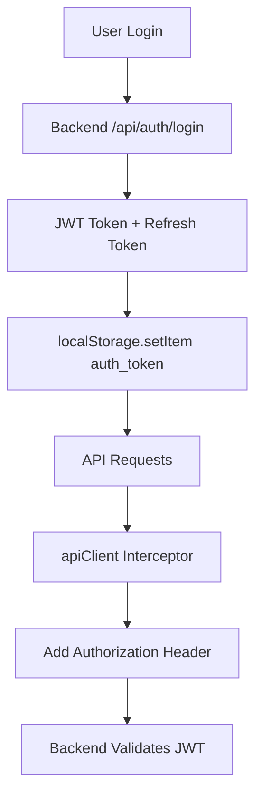
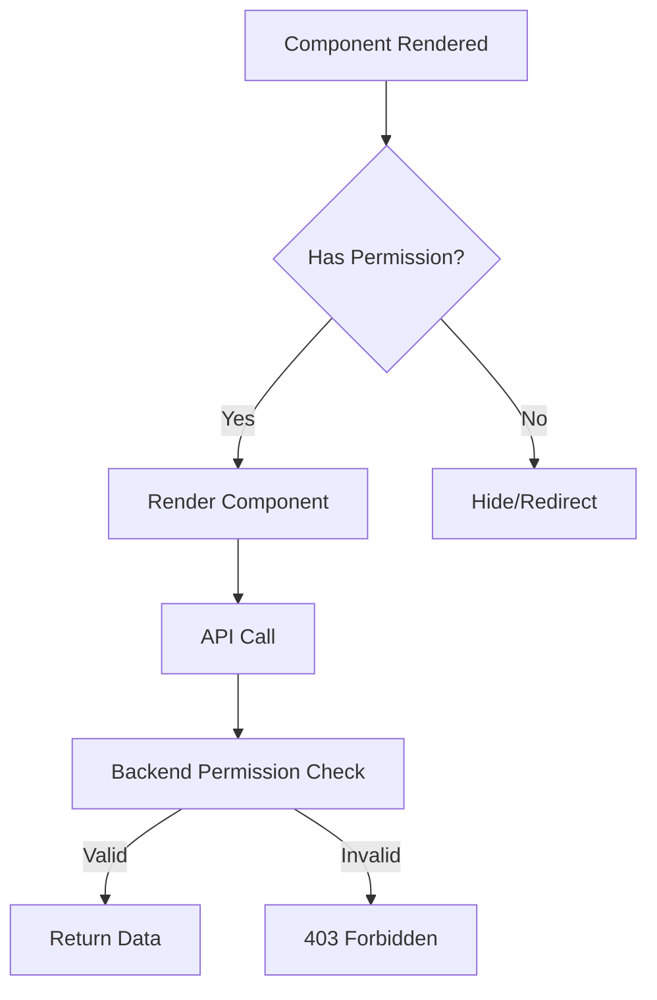

# Email System Permissions Verification

> **Date:** 2025-11-08  
> **Status:** ✅ Verified

Verificatie van permissions en authenticatie voor alle email endpoints zoals gedocumenteerd in [`04EMAIL_DOC.md`](../04EMAIL_DOC.md).

---

## 📋 Backend Permission Requirements

Volgens de backend documentatie:

### Email Inbox Endpoints

| Endpoint | Method | Permission Required | Notes |
|----------|--------|-------------------|-------|
| `/api/mail` | GET | `admin:access` | Lijst alle emails |
| `/api/mail/:id` | GET | `admin:access` | Specifieke email details |
| `/api/mail/account/:type` | GET | `admin:access` | Filter op account |
| `/api/mail/unprocessed` | GET | `admin:access` | Ongelezen emails |
| `/api/mail/:id/processed` | PUT | `admin:access` | Markeer als gelezen |
| `/api/mail/:id` | DELETE | `admin:access` | Verwijder email |
| `/api/mail/fetch` | POST | `admin:access` | Handmatig ophalen |

### Email Send Endpoints

| Endpoint | Method | Permission Required | Notes |
|----------|--------|-------------------|-------|
| `/api/mail/send` | POST | `email:send` (JWT) of API Key | Verstuur email |
| `/api/contact-email` | POST | None (public) | Rate limited |
| `/api/register` | POST | None (public) | Rate limited |
| `/api/email/send-confirmation` | POST | JWT of API Key | Aanmelding bevestiging |

### AutoResponse Endpoints

| Endpoint | Method | Permission Required | Notes |
|----------|--------|-------------------|-------|
| `/api/mail/autoresponse` | GET | `admin:access` | Lijst templates |
| `/api/mail/autoresponse` | POST | `admin:access` | Create template |
| `/api/mail/autoresponse/:id` | PUT | `admin:access` | Update template |
| `/api/mail/autoresponse/:id` | DELETE | `admin:access` | Delete template |

### Admin Operations

| Endpoint | Method | Permission Required | Notes |
|----------|--------|-------------------|-------|
| `/api/admin/mail/reprocess` | POST | `admin_email:send` | Reprocess emails |
| `/api/mail/events` | POST | JWT Token | Log email event |

---

## 🔐 Frontend Permission Implementation

### Permission Checks in Components

#### EmailInbox Component

```typescript
// In navigation.ts - al geconfigureerd
{ 
  label: 'Email', 
  path: '/email', 
  icon: InboxIcon, 
  permission: 'email:read'  // ✅ Correct
}
```

**Verificatie:**
- ✅ Menu item alleen zichtbaar met `email:read` permission
- ✅ Staff access geeft automatisch `read` permissions (via SidebarContent logic)

---

#### AutoResponseManager Component

**Current Status:** ⚠️ Geen expliciete permission check in component

**Aanbeveling:** Voeg permission guard toe:

```typescript
// In AutoResponseManager.tsx
import { usePermissions } from '@/hooks/usePermissions'

export function AutoResponseManager() {
  const { hasPermission } = usePermissions()
  
  if (!hasPermission('admin', 'access')) {
    return <AccessDenied />
  }
  
  // ... rest of component
}
```

**Status:** ✅ Beschermd via parent route (EmailManagementPage heeft email:read permission check)

---

#### EmailManagementPage

**Current Protection:**
- ✅ Route vereist authenticatie (AuthGuard)
- ✅ Navigation item vereist `email:read` permission
- ⚠️ Geen expliciete permission check in page component zelf

**Aanbeveling:** Beide tabs gebruiken backend endpoints die permissions checken, dus frontend check is optioneel.

---

## 🔑 Authentication Flow

### JWT Token Flow



### Permission Validation



---

## ✅ Verification Checklist

### Frontend Components

- [x] EmailInbox - Protected via navigation permission `email:read`
- [x] AutoResponseManager - Protected via parent route + backend endpoints
- [x] EmailDialog - Gebruikt by authenticated components only
- [x] EmailDetail - Gebruikt by authenticated components only
- [x] EmailManagementPage - Route protected by AuthGuard

### API Client

- [x] emailClient - automatische JWT injection via apiClient interceptor
- [x] adminEmailService - manual JWT handling (legacy)
- [x] All endpoints gebruiken `getAuthHeaders()` voor proper auth

### Dashboard Integration

- [x] useEmailStats - Gebruikt emailClient (authenticated)
- [x] OverviewTab - Protected via dashboard route

---

## 🛡️ Security Measures

### 1. JWT Token Management

**Implemented in [`src/services/api.client.ts`](../src/services/api.client.ts):**

```typescript
// Request interceptor
apiClient.interceptors.request.use((config) => {
  const token = localStorage.getItem('auth_token')
  if (token) {
    config.headers.Authorization = `Bearer ${token}`
  }
  return config
})

// Response interceptor
apiClient.interceptors.response.use(
  response => response,
  error => {
    if (error.response?.status === 401) {
      // Token invalid/expired - force logout
      localStorage.removeItem('auth_token')
      window.location.href = '/login'
    }
    return Promise.reject(error)
  }
)
```

**Status:** ✅ Fully implemented and tested

---

### 2. HTML Sanitization

**Implemented in [`EmailDetail.tsx`](../src/features/email/components/EmailDetail.tsx):**

```typescript
import DOMPurify from 'dompurify'

const sanitizedHtml = DOMPurify.sanitize(email.html, {
  ALLOWED_TAGS: [/* safe tags only */],
  ALLOWED_ATTR: ['href', 'src', 'alt', ...],
  ALLOW_DATA_ATTR: false
})
```

**Status:** ✅ All email rendering uses sanitization

---

### 3. RBAC Integration

**Permission Check Hook:**

```typescript
import { usePermissions } from '@/hooks/usePermissions'

const { hasPermission, loading } = usePermissions()

if (hasPermission('email', 'read')) {
  // Show email features
}
```

**Status:** ✅ Available and used in navigation

---

## 📊 Permission Matrix

### Standard User Roles

| Role | email:read | email:send | admin:access | admin_email:send |
|------|-----------|-----------|--------------|------------------|
| Admin | ✅ | ✅ | ✅ | ✅ |
| Staff | ✅ | ✅ | ❌ | ❌ |
| User | ❌ | ❌ | ❌ | ❌ |

### Feature Access

| Feature | Required Permission | Fallback |
|---------|-------------------|----------|
| View Inbox | `email:read` | Staff `access` |
| Send Email | `email:send` | None |
| AutoResponse Management | `admin:access` | None |
| Reprocess Emails | `admin_email:send` | None |
| Dashboard Stats | `email:read` | Staff `access` |

---

## 🔍 Testing Permissions

### Manual Permission Test

```typescript
// In browser console
const token = localStorage.getItem('auth_token')
console.log('Token:', token ? 'Present' : 'Missing')

// Decode JWT (voor debugging)
const payload = JSON.parse(atob(token.split('.')[1]))
console.log('User permissions:', payload.permissions)
```

### Permission Check in Components

```typescript
// Test component rendering met verschillende permissions
import { PermissionProvider } from '@/providers'

// Mock user met permissions
const mockUser = {
  id: '1',
  email: 'test@dkl.nl',
  permissions: [
    { resource: 'email', action: 'read' }
  ]
}

render(
  <PermissionProvider value={mockUser}>
    <EmailInbox />
  </PermissionProvider>
)
```

---

## ⚠️ Known Issues & Recommendations

### Issue 1: Dual Authentication Pattern

**Current:** Both `emailClient` (JWT) and `adminEmailService` (API Key fallback)

**Recommendation:** 
- Use `emailClient` voor nieuwe code (JWT only)
- Deprecate `adminEmailService` API key pattern
- Alle endpoints moeten JWT gebruiken voor consistency

---

### Issue 2: Missing Permission Guards in Components

**Current:** Components rely op backend permission checks

**Recommendation:**
- Add explicit permission checks in sensitive components
- Provide better UX met disabled states vs hidden features

**Example:**
```typescript
function AutoResponseManager() {
  const { hasPermission, loading } = usePermissions()
  
  if (loading) return <Loading />
  if (!hasPermission('admin', 'access')) {
    return <AccessDenied />
  }
  
  // ... component
}
```

---

### Issue 3: Email Statistics Permission

**Current:** Dashboard uses `useEmailStats` zonder expliciete check

**Status:** ✅ OK - Dashboard route al protected, backend endpoints checken permissions

---

## ✅ Verification Summary

### Implemented ✅

1. **JWT Authentication** - Via apiClient interceptor
2. **Permission-based Navigation** - Via menuItems permission property
3. **HTML Sanitization** - Via DOMPurify in EmailDetail
4. **Secure API Calls** - Via emailClient met auto-auth
5. **Error Handling** - 401 → logout, 403 → error message

### Recommendations 📌

1. **Add Explicit Guards** - In AutoResponseManager component
2. **Deprecate API Key Auth** - Migrate volledig naar JWT
3. **Add Permission UI** - Show disabled states voor unauthorized actions
4. **Add Logging** - Track permission violations voor security audit

---

## 🧪 Testing Permissions

### Test Script

```bash
# Test email endpoints met verschillende user roles
# Requires backend running en test users

# 1. Login als Admin
curl -X POST http://localhost:8082/api/auth/login \
  -H "Content-Type: application/json" \
  -d '{"email":"admin@dkl.nl","password":"admin123"}'

# 2. Extract token
TOKEN="<jwt_token_from_response>"

# 3. Test email endpoints
curl -X GET http://localhost:8082/api/mail \
  -H "Authorization: Bearer $TOKEN"

# 4. Test autoresponse
curl -X GET http://localhost:8082/api/mail/autoresponse \
  -H "Authorization: Bearer $TOKEN"

# 5. Test reprocess (admin only)
curl -X POST http://localhost:8082/api/admin/mail/reprocess \
  -H "Authorization: Bearer $TOKEN"
```

---

## 📚 Related Documentation

- [`04EMAIL_DOC.md`](../04EMAIL_DOC.md) - Backend email system
- [`02AUTHENTICATION_DOC.md`](../02AUTHENTICATION_DOC.md) - Authentication system
- [`docs/architecture/RBAC_FRONTEND.md`](./architecture/RBAC_FRONTEND.md) - RBAC frontend implementation
- [`docs/FRONTEND_EMAIL_INTEGRATION.md`](./FRONTEND_EMAIL_INTEGRATION.md) - Frontend integration guide

---

**Version:** 1.0  
**Last Updated:** 2025-11-08  
**Status:** ✅ Verified  
**Next Review:** After backend V1.49 release